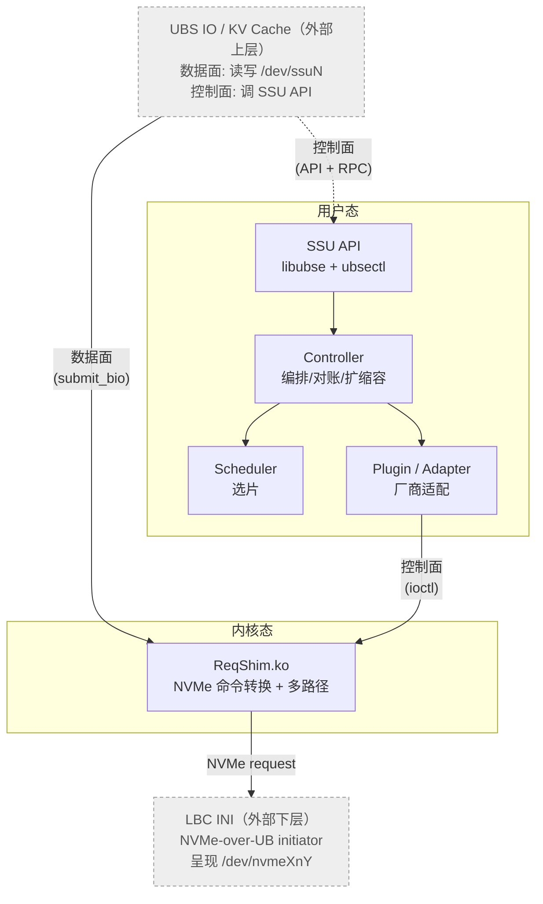

# UBSEComponentPlugins

> openEuler [`ubs-engine`](https://gitcode.com/openeuler/ubs-engine) 的 **SSU 池化组件** —— 把物理 SSU（Shared Storage Unit）资源池化，对上层以逻辑块设备 `/dev/ssuN` 的形式提供，并在内核态完成 NVMe 命令转换与多路径下发。

[-blue)]()
[]()
[]()
[]()

---

## 目录

- [这是什么](#这是什么)
- [架构一览](#架构一览)
- [仓库结构](#仓库结构)
- [快速开始（mock，无需真实硬件）](#快速开始mock无需真实硬件)
- [构建](#构建)
- [测试与验收](#测试与验收)
- [运行时角色与 CLI](#运行时角色与-cli)
- [项目状态（MVP）](#项目状态mvp)
- [设计文档](#设计文档)
- [路线图（MVP 之后）](#路线图mvp-之后)
- [贡献](#贡献)

---

## 这是什么

`ubs-engine` 是 openEuler 的软件定义计算资源调度引擎。本仓库为其提供 **SSU 池化** 能力，覆盖完整链路：

- **发现纳管**：经 LBC INI（NVMe-over-UB initiator，行为对标 NVMe-oF host）发现并纳管集群中的 SSU。
- **资源分配 / 挂载 / 解挂载 / 释放（两步）**：在组件 SSU 上 `CreateNS`，把空间挂载成本机逻辑块设备 `/dev/ssuN`；`unmount` 保留数据、`release` 物理擦除并删除 namespace。
- **命令转换（数据面）**：内核态 `ReqShim` 把对 `/dev/ssuN` 的普通读写转换为 NVMe request，提交到 LBC INI 暴露的 `/dev/nvmeXnY` 队列，经 NVMe-over-UB 下发到 SSU。
- **扩缩容**：共享 namespace 的节点访问路径增删。

**关键特点**

- **独立交付**：用户态 `.so` + 内核态 `.ko`，与上游 `ubs-engine` 构建解耦，运行期加载。
- **可脱离 UBSE 独立验证**：内置 mock plugin（`null_blk` / 文件后端）与 UBS IO 替身 `ssu_smoke`，无需真实 SSU / LBC INI / 上游 daemon 即可跑通全链路验收。
- **能力门控前置**：REPLICA / EC / NDS / 多流在当前阶段请求一律返回 `SSU_ERR_UNSUPPORTED`，不静默降级。

> ℹ️ 外部邻居 **UBS IO**（上层，含 KV Cache）与 **LBC INI**（下层）不在本仓库交付范围内，但定义了组件的上下边界。

---

## 架构一览



五个代码模块：**API**（对外门面，5 类操作）→ **Controller**（编排/对账/扩缩容）→ **Scheduler**（选片）→ **Plugin**（厂商适配，对接 LBC INI 与 ReqShim）→ **ReqShim**（内核态块设备驱动，命令转换）。Manager / Agent 是同一份 daemon 的两个运行时角色，非独立模块。

完整架构（含数据面 15 步路径、与 OS / LBC INI 的逐接口契约）见 [设计文档 §2 / §4 / §6](docs/design/implementation-design.md)。

---

## 仓库结构

```
UBSEComponentPlugins/
├── include/                  # 对外公共头：ssu_api.h / ssu_controller.h / ssu_plugin.h / ssu_dataplane.h
├── src/
│   ├── user/
│   │   ├── api/              # libssu_api（5 操作对外 ABI）
│   │   ├── controller/       # Controller：分配/2 步释放/纳管/对账/扩缩容
│   │   ├── scheduler/        # Scheduler：MVP 最简选片
│   │   ├── dataplane/        # 用户态数据面辅助
│   │   ├── runtime/          # 角色装配：ssu-mgr / ssu-agent 启动入口
│   │   └── plugin/vendors/mock/   # mock plugin（null_blk / 文件后端）
│   └── kernel/reqshim/       # ssu_reqshim.ko（内核态块设备驱动，独立 Kbuild）
├── tools/ubsectl.cpp         # ubsectl CLI
├── tests/
│   ├── contract/             # 契约测试（能力门控、生命周期、extent 缓冲区等）
│   ├── mvp1..mvp5/check.sh   # 各 MVP 阶段独立验收脚本
│   └── stubs/ubs_io/         # UBS IO 替身：ssu_smoke
├── scripts/build_reqshim.sh  # 内核模块构建辅助
├── meson.build / meson_options.txt
└── docs/design/              # 设计文档 + MVP 实现计划
```

---

## 快速开始（mock，无需真实硬件）

以 mock 后端跑通"发现纳管 → 查询池"，验证环境可用：

```bash
# 1. 构建（默认 mock vendor，不含内核模块）
meson setup build
ninja -C build

# 2. 以 Manager 角色跑一次（mock 出 2 个 SSU），查询池
SSU_MOCK_SSU_COUNT=2 ./build/src/user/runtime/ssu-mgr \
    --role manager --config tests/mvp1/ssu.conf --once
# 期望输出含：pool entries: 2

# 3. 用 CLI 查询
SSU_MOCK_SSU_COUNT=2 ./build/tools/ubsectl query --type pool
# 期望输出含：mock-ssu0  mock-host0  ONLINE  0/1073741824
```

跑一次完整的 SDK 端到端（分配→挂载→读写校验→解挂载→释放，文件后端）：

```bash
mkdir -p /tmp/ssu-backend
SSU_MOCK_SSU_COUNT=1 SSU_MOCK_BACKEND_DIR=/tmp/ssu-backend \
    ./build/tests/stubs/ubs_io/ssu_smoke \
        --alloc --size 65536 --stripe \
        --mount --dev /dev/ssu0 \
        --io --pattern verify \
        --unmount --release
echo $?   # 0 = 全链路通过
```

---

## 构建

**用户态（默认）**

```bash
meson setup build
ninja -C build
```

Meson 选项（`meson_options.txt`）：

| 选项 | 默认 | 说明 |
| ---- | ---- | ---- |
| `vendor` | `mock` | 厂商 plugin（当前仅 mock） |
| `combine_core` | `false` | 是否合并 Controller+Scheduler 为单一 `libssu_core.so` |
| `build_kernel` | `disabled` | 是否构建 out-of-tree ReqShim `.ko` |
| `kernel_src_dir` | `''` | 内核构建树，如 `/lib/modules/$(uname -r)/build` |

**内核模块（可选，需内核头）**

```bash
meson setup build -Dbuild_kernel=enabled \
    -Dkernel_src_dir=/lib/modules/$(uname -r)/build
ninja -C build
# 产物：build/src/kernel/reqshim/ssu_reqshim.ko
```

或直接用辅助脚本：`scripts/build_reqshim.sh`。

---

## 测试与验收

```bash
ninja -C build test           # 契约测试（能力门控/生命周期/extent 缓冲区/mock 数据面）
```

各 MVP 阶段的端到端验收脚本（可独立重复运行）：

```bash
# 用法：check.sh <build_dir> <source_dir>
tests/mvp1/check.sh build .   # mock 池纳管 + query(pool)
tests/mvp2/check.sh build .   # 控制面：alloc/mount/unmount/release
tests/mvp3/check.sh build .   # 数据面：mock 读写校验
tests/mvp4/check.sh build .   # SDK 全链路（ssu_smoke）
tests/mvp5/check.sh build .   # 扩缩容（共享 mount）
```

> 内核态 ReqShim 的真实数据面（NVMe 命令转换）在接真实 LBC INI 时验证；mock 下数据面经 `reqshim_phys` 抽象层用标准块 I/O 落到 `null_blk`/文件后端，可读回校验。

---

## 运行时角色与 CLI

Manager 与 Agent 是**同一份 daemon 的两种启用方式**（`ssu-mgr` / `ssu-agent`），由 `ssu.conf` 的 `role` 装配：

```ini
# ssu.conf
role=manager      # manager | agent
vendor=mock       # 当前仅 mock
```

CLI：

```bash
ubsectl alloc   --size BYTES --stripe|--replica N [--out FILE]
ubsectl mount   --aid AID --host HOST --dev /dev/ssuN
ubsectl unmount --dev /dev/ssuN
ubsectl release --aid AID
ubsectl query   --type pool|allocation|logdev
```

控制面 RPC 走 Unix socket，路径由环境变量 `SSU_MGR_SOCKET` 指定（默认本地）。

---

## 项目状态（MVP）

MVP 目标是**脱离 UBSE 独立验证**核心闭环：控制面（发现纳管 / 分配 / 2 步释放）+ 普通读写数据面。当前进度：

| 阶段 | 内容 | 状态 |
| ---- | ---- | ---- |
| MVP-0 | 骨架：三套契约（API / plugin ops / ReqShim UAPI）+ Meson + `.ko` 可加载 | ✅ |
| MVP-1 | mock SSU 池发现纳管 + `query(pool)` | ✅ |
| MVP-2 | 控制面 5 操作 + 两步释放 + 能力门控 | ✅ |
| MVP-3 | 数据面（mock：命令转换 + 文件后端读写校验） | ✅ |
| MVP-4 | SDK 全链路（`ssu_smoke`） | ✅ |
| MVP-5 | 扩缩容（共享 namespace 节点路径增删） | ✅ |

> MVP 阶段所有验收均基于 mock 桩（`null_blk` / 文件后端 / `ssu_smoke`），不依赖真实 SSU、LBC INI、UBS IO 或上游 ubse daemon。真实联调时把桩替换为真实依赖，跑同一套验收脚本即可。

---

## 设计文档

- [详细实现设计](docs/design/implementation-design.md) —— 架构、5 操作 API、各模块详设、与 OS / LBC INI 的逐接口契约、里程碑、风险。
- [MVP 实现计划](docs/design/mvp-implementation-plan.md) —— 脱离 UBSE 独立验证的桩化策略、MVP-0~5 分解与脚本化验收。
- 上游依据：[架构设计 Issue #1](https://github.com/sisibeloved/UBSEComponentPlugins/issues/1)、[功能设计 Issue #2](https://github.com/sisibeloved/UBSEComponentPlugins/issues/2)。

---

## 路线图（MVP 之后）

| 阶段 | 内容 |
| ---- | ---- |
| M6 | NDS 近数据访问（liburma / NPU EID / HBM） |
| M7 | 多流（NVMe stream-ID 热/冷分离） |
| M8 | 多副本扇出 + EC 编码 |
| M9 | Scheduler 评分 / 带宽预留 / 跨节点亲和 |
| M10 | 对账收敛、重启重建、可观测性、plugin 进程级隔离、接入上游 ubse daemon |

详见设计文档 §12.2。

---

## 贡献

当前处于 MVP 阶段，接口（API / plugin ops / ReqShim UAPI）已冻结，真实厂商 plugin 与 mock plugin 共用同一契约。提交前请确保：

```bash
ninja -C build test              # 契约测试全绿
tests/mvp4/check.sh build .      # 端到端验收通过
```
