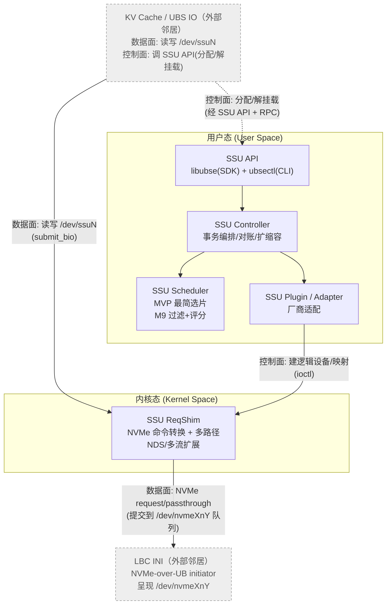
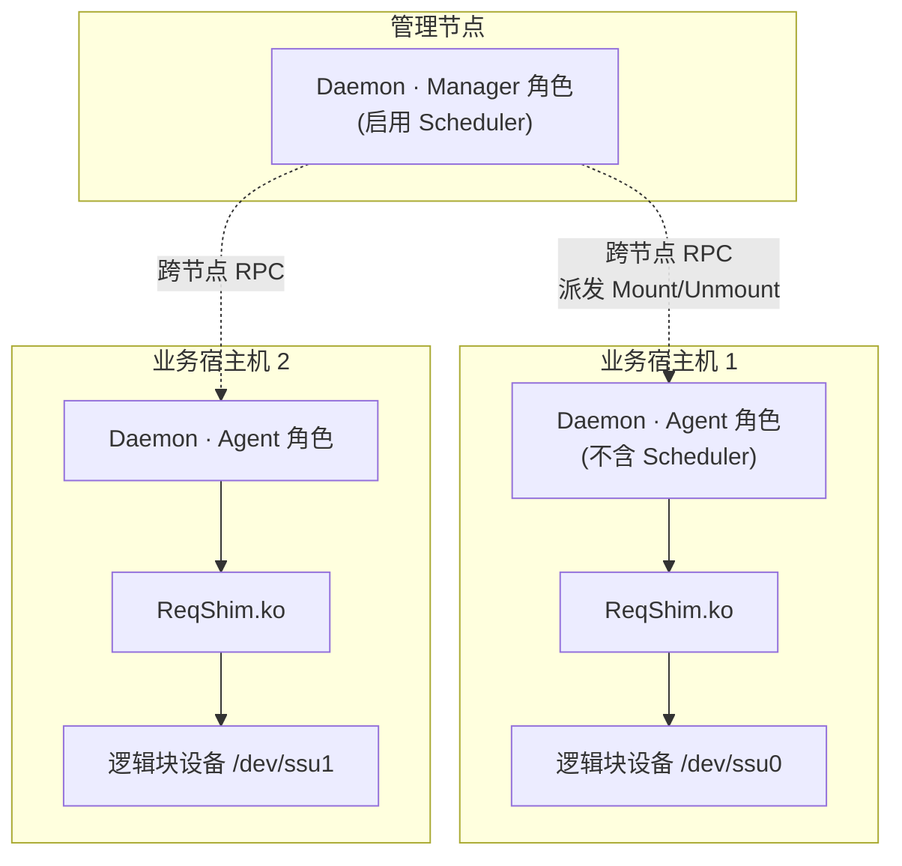
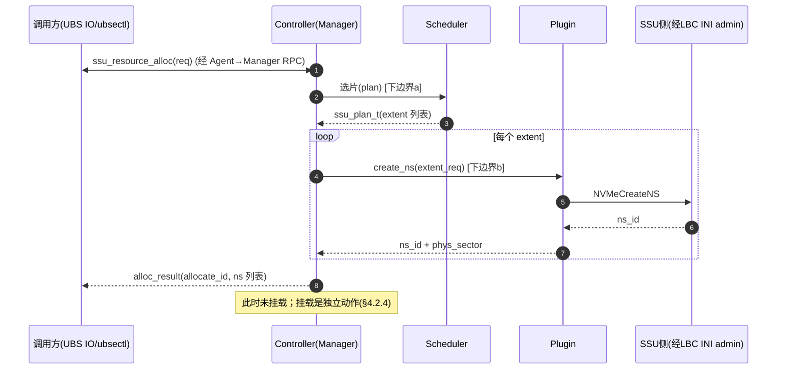
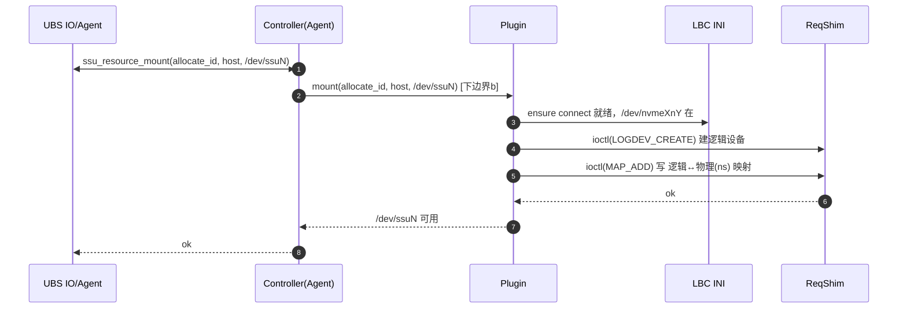
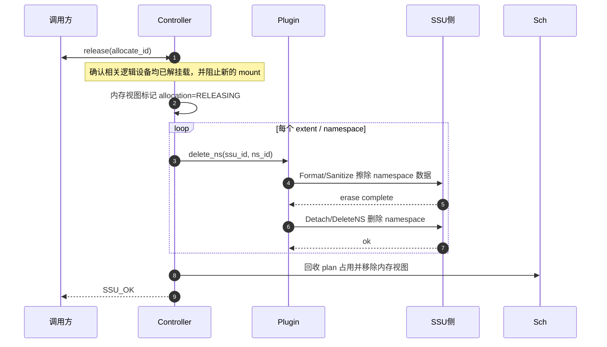
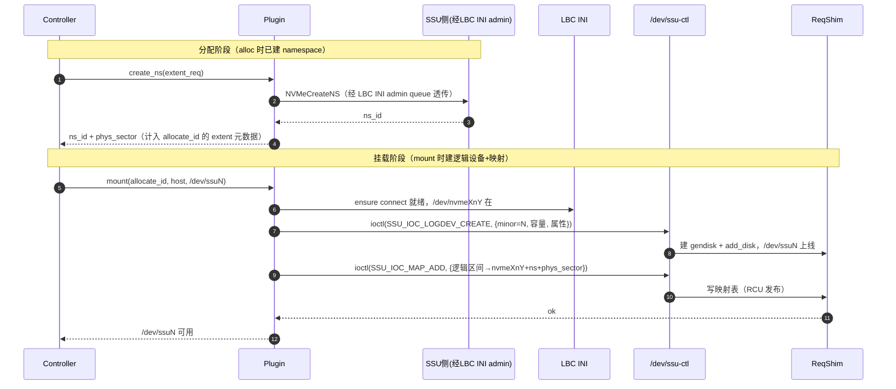
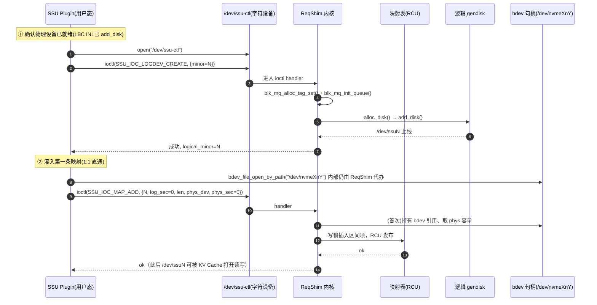
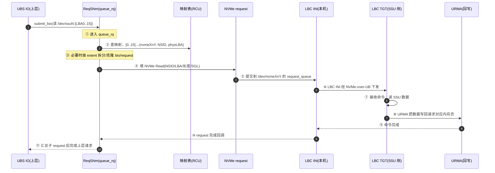

# UBSEComponentPlugins 详细实现设计

> 项目：UBSEComponentPlugins —— openEuler `ubs-engine` 的 SSU 池化组件插件集
> 上游：https://gitcode.com/openeuler/ubs-engine
> 架构设计依据：[Issue #1](https://github.com/sisibeloved/UBSEComponentPlugins/issues/1)
> 功能设计依据：[Issue #2](https://github.com/sisibeloved/UBSEComponentPlugins/issues/2)

---

## 0. 修订与约定

| 版本 | 日期 | 说明 |
| ---- | ---- | ---- |
| v0.1 | 2026-06-16 | 首版实现设计 |
| v0.2 | 2026-06-16 | 去除刻意澄清；修正 Manager/Agent 为运行时角色而非模块 |

**术语**

| 术语 | 含义 |
| ---- | ---- |
| SSU | Shared Storage Unit，共享存储单元，被池化的物理资源 |
| SSU Manager / SSU Agent | **同一份 daemon 代码的两个运行时角色**（部署同一套代码，运行时按角色激活不同子系统、承担不同职责与权限）。Manager 承担集群级发现、纳管、状态检测与全局分配/释放；Agent 承担本宿主机的逻辑块设备挂载/解挂及与 ReqShim 的映射同步 |
| ReqShim | 内核态块设备驱动（`.ko`），向上呈现逻辑块设备 `/dev/ssuN`，普通读写在内核态查映射并组装 NVMe Read/Write 命令，再以 blk-mq request/passthrough request 形式提交到 LBC INI 暴露的 `/dev/nvmeXnY` 队列；LBC INI 负责 NVMe-over-UB 下发与 URMA 回写；NDS、多流为后续扩展 |
| Plugin（SSU Adapter） | 用户态适配器，屏蔽不同 SSU 厂商/协议的差异，向上提供统一发现与配置能力 |
| 逻辑块设备 | 在宿主机上挂载出的、对上层呈现为块设备的访问入口 |

> 说明：Manager / Agent **不是独立的代码模块**——它们是同一个 daemon 进程在运行时按配置启用的角色。架构设计 #1 列出的五个代码元素（API / Controller / Scheduler / Plugin / ReqShim）才是真正的模块边界，Manager / Agent 是在这些模块之上、根据角色组合出的运行时视图。

---

## 1. 设计目标与范围

### 1.1 目标

1. 为 `ubs-engine` 提供 **SSU 池化** 能力，覆盖发现、纳管、分配、释放、查询、挂载、命令转换全链路。
2. 在**不侵入上游构建**的前提下，以独立可交付组件形态存在（用户态 `.so` + 内核态 `.ko`）。
3. 通过 Plugin 适配层屏蔽 SSU 厂商/协议差异，保证后续扩展零侵入。
4. 提供清晰的内核态/用户态边界与协议，便于独立测试与演进。

### 1.2 范围

| 在范围内 | 不在范围内 |
| ---- | ---- |
| SSU Manager / SSU Agent 两个运行时角色的职责划分（同一 daemon 代码） | 具体某厂商 SSU 硬件的私有协议实现细节（仅给出适配点） |
| Controller、Scheduler、Plugin、API | 上游 `ubs-engine` 主框架代码改动 |
| ReqShim 内核模块的接口设计与实现方案 | 操作系统发行版打包（RPM/spec 等）——给出交付清单，打包脚本后续补 |
| 用户态↔内核态协议 | 监控告警、计费等运营系统对接 |

---

## 2. 总体架构

### 2.1 分层模块视图

按运行态与调用方向，五个代码模块的分层与依赖关系如下（本图只描述模块与调用关系，不涉及部署形态）：



调用方向分**两条面**，外部邻居 UBS IO 在两条面上都出现：

- **控制面**（虚线）：UBS IO / 管理员 → SSU API（`libubse` SDK / `ubsectl` CLI）→ 经 RPC 到 Controller → Scheduler 选片 → Plugin 落实。注意 **UBS IO 既是数据面消费者，也是控制面参与者**——集群节点扩容/缩容时，新节点或缩节点的 UBS IO 会主动调 SSU API 的挂载/解挂载接口（带 `allocateID`，作用于共享逻辑块设备的节点读写范围）。详见 §4.2 扩缩容。
- **数据面**（实线）：UBS IO 经 `/dev/ssuN` 发 I/O → ReqShim 查映射、改写 NSID/LBA 并组装 NVMe Read/Write 命令 → 以 blk-mq request/passthrough request 提交到 LBC INI 暴露的 `/dev/nvmeXnY` 队列 → LBC INI 经 NVMe-over-UB 通道下发到 SSU 侧硬件。

用户态模块间走进程内调用或 RPC；用户态↔内核态走 ioctl/系统调用；ReqShim↔LBC INI 的普通读写边界是 LBC INI 所注册 `/dev/nvmeXnY` 的块队列，而不是 LBC 私有控制 ABI。图中的灰色虚线节点（UBS IO、LBC INI）为本组件**外部邻居**，不在交付范围内，但分别定义了 ReqShim 的上边界（数据面）与 Controller 的控制面触发点（UBS IO）。

**职责一句话**

- **SSU API**：对外门面，`libubse` SDK + `ubsectl` CLI，承接 5 类操作（分配/挂载/释放/解挂载/查询），经 RPC 路由到 Controller。见 §3。
- **SSU Controller**：编排核心，负责分配/2 步释放/发现纳管/对账/扩缩容，调用 Scheduler 选片、调用 Plugin 落实，并跨 Agent RPC 协调。见 §4.2。
- **SSU Scheduler**：MVP 负责 STRIPE 最简选片；M9 扩展为可配置策略引擎，加入带宽 headroom、跨节点亲和与负载均衡评分。见 §4.3。
- **SSU Plugin（Adapter）**：屏蔽厂商差异，负责发现纳管（udev/NVMe Discover/Connect/Smartlog）、资源分配（NVMeCreateNS）、挂载/解挂载、2 步释放。详见 §4.4。
- **SSU ReqShim**：内核态块设备驱动，向上呈现逻辑块设备，向下把普通读写转换为 NVMe request/passthrough request 并提交到一/多个 LBC INI 物理块设备队列；NDS、多流作为后续扩展。详见 §4.6。

### 2.2 部署视图

部署是另一个层面：同一份 daemon 二进制部署到集群各节点，运行时按角色激活不同子系统；ReqShim 作为内核模块驻留于每个需要本地逻辑块设备的节点。



- **Manager 角色**：集群级职责——SSU 发现、纳管、状态检测、全局分配/释放；由 Scheduler+Controller+Plugin 组合实现。
- **Agent 角色**：节点级职责——接纳下发、在本地完成逻辑块设备挂载/解挂、与 ReqShim 同步映射；复用 Controller+Plugin，不含 Scheduler。
- 一个 daemon 实例可仅作为 Agent（常态），也可同时启用 Manager 子系统（少数集群管理节点）。Manager 与 Agent 是**同一份 daemon**的两种启用方式，详见 §4.5。

> 说明：分层模块视图（§2.1）回答"有哪些模块、谁调用谁"；部署视图（§2.2）回答"模块如何落到节点、以什么角色运行"。两者不是同一层面，请勿混读。

### 2.3 代码元素 ↔ 产物映射

依据架构设计（#1）的五个代码元素，结合"用户态 `.so` / 内核态 `.ko` 独立交付"的选型：

| 代码元素 | 运行态 | 交付产物 | 归属 |
| ---- | ---- | ---- | ---- |
| SSU API / SDK | 用户态 | `libubse_ssu_sdk.so` + `ubse_ssu_sdk.h`（上游客户端） / `libssu_api.so`（server 侧） | 本组件 |
| SSU Controller | 用户态 | `libssu_controller.so`（被 daemon 加载/链接） | 本组件 |
| SSU Scheduler | 用户态 | `libssu_scheduler.so` | 本组件 |
| SSU Plugin（Adapter） | 用户态 | `libssu_plugin_<vendor>.so`（每个厂商一份，可热插拔） | 本组件 |
| SSU ReqShim | **内核态** | `ssu_reqshim.ko` | 本组件 |

> Controller / Scheduler 在首版可合并编译为单一 `.so`（`libssu_core.so`）以降低交付面，内部仍保持模块边界；下文按逻辑模块分别描述。其余用户态产物统一采用完整命名，不做缩写。

### 2.4 与上游 ubse daemon 的关系

```
┌──────────────────────────── ubse daemon (上游) ────────────────────────────┐
│  framework/plugin_mgr ── dlopen ──►  本组件用户态 .so（API/Controller/      │
│                                        Scheduler/Plugin）                   │
│                                          │                                   │
│                                          │  加载 ReqShim：                    │
│                                          │   insmod/modprobe ssu_reqshim.ko    │
└──────────────────────────────────────────┼───────────────────────────────────┘
                                           ▼
                              ┌──── 内核：ssu_reqshim.ko ────┐
                              │  逻辑块设备 ↔ SSU 映射表      │
                              │  NVMe request 转换与扇出     │
                              └──────────────────────────────┘
```

上游 daemon 通过其既有 `framework/plugin_mgr` 机制以运行期 `dlopen` 加载本组件用户态库；ReqShim 作为内核模块由 daemon（以 Agent 角色运行时）通过 `modprobe` 加载。**两端不共享构建系统、不共享源码树。**

---

## 3. 外部接口设计（SSU API）

依据架构设计 #1 与功能设计 #2，SSU API 是组件对外的统一入口，对外以 **`libubse` SDK（C 库）** 与 **`ubsectl` CLI** 两种形态提供，二者共用同一套语义接口。

对集成方优先暴露的是 **6 个逻辑接口**：`ALLOCATE` / `ALLOCATE_RESULT_GET` / `LIST` / `MOUNT` / `UNMOUNT` / `FREE`。它们隐藏内部 `allocate_id`、namespace、ReqShim 映射等细节；兼容层仍保留 `ssu_resource_*` 与 `ubsectl alloc/release/query`，便于调试和老脚本继续工作。

### 3.1 接口总表

| 操作 | 提供者 | 使用者 | 类型 | 语义 | 变更 |
| ---- | ---- | ---- | ---- | ---- | ---- |
| 资源分配 | SSU Manager | 管理员/UBS IO/存储业务 | lib | 按空间大小、带宽、可靠性（STRIPE；EC/REPLICA 为前向预留，能力门控见 §3.3）、共享方式、共享范围、容器映射方向等要求，选 SSU 并在每个组件 SSU 上 `NVMeCreateNS` 创建命名空间，返回 `allocateID` | 新增 |
| 资源挂载 | SSU Agent/Manager | UBS IO/存储业务 | lib | 按 `allocateID` 在目标宿主机把分配到的空间挂载成逻辑块设备（建 ReqShim 逻辑设备 + 经 LBC INI 连 NOU + 写映射），供上层访问 | 新增 |
| 资源解挂载 | SSU Agent/Manager | UBS IO/存储业务 | lib | 删除本机逻辑块设备及物理块设备、断开 NOU 连接，**但保留 SSU 侧数据**（命名空间仍在），便于后续重新挂载或迁移 | 新增 |
| 资源释放 | SSU Manager | 管理员/UBS IO | lib | 先确认相关逻辑设备已解挂载并阻止新的 mount，再对 namespace 执行 Format/Sanitize 完成**物理擦除**，确认后 DeleteNS/Detach 删除命名空间；彻底归还 SSU 物理空间 | 新增 |
| 资源查询 | SSU Manager | 管理员/UBS IO/存储业务 | lib | 按 `ssu_query_type_t` 查询池化 SSU 资源（容量/状态/拓扑）、分配实例/extent 明细、逻辑设备/ReqShim 映射 | 新增 |

**两种形态：**

- **`libubse` SDK**：C ABI 动态库，供 UBS IO、存储业务系统直接链接，程序化调用。
- **`ubsectl` CLI**：命令行工具，供管理员运维（纳管、分配、挂载、查询、扩缩容触发），内部封装同一组 SDK 接口。

**逻辑接口与 CLI 对照：**

| 逻辑接口 | SDK | CLI | 说明 |
| ---- | ---- | ---- | ---- |
| `INTF_SSU_API_ALLOCATE` | `ubse_ssu_sdk_ops_t.allocate` | `ubsectl allocate` | 输入逻辑盘空间大小、用户 ID、物理盘数、逻辑盘聚合开关、共享/独占类型、HostId 列表；返回请求 ID。`physical_disk_count=0` 表示按默认单张物理盘分配，也可指定 N 张物理盘；逻辑盘聚合默认打开，MVP 关闭聚合返回 `SSU_ERR_UNSUPPORTED`。用户 ID 和 HostId 是业务透传标签，上游业务系统负责租户隔离/授权，本组件不做业务校验。 |
| `INTF_SSU_API_ALLOCATE_RESULT_GET` | `ubse_ssu_sdk_ops_t.allocate_result_get` | `ubsectl allocate-result-get` | 输入请求 ID；成功返回预留逻辑设备路径（如 `/dev/ssu/ssu0` 或 `/dev/ssu/<name>`）以及各物理盘的 `ssu_id`、`ns_id`、逻辑偏移、长度、LBA；失败返回错误码和错误信息。 |
| `INTF_SSU_API_LIST` | `ubse_ssu_sdk_ops_t.list` | `ubsectl list` | 返回当前可用于分配的 SSU 资源列表；函数返回值表达请求成功/失败状态。 |
| `INTF_SSU_API_MOUNT` | `ubse_ssu_sdk_ops_t.mount` | `ubsectl mount --dev /dev/ssu/ssuN --host HOST` | 输入设备路径与 Host ID；内部反查请求 ID/分配实例，然后建立本机逻辑设备映射。 |
| `INTF_SSU_API_UNMOUNT` | `ubse_ssu_sdk_ops_t.unmount` | `ubsectl unmount --dev /dev/ssu/ssuN` | 解挂载逻辑设备；保留 SSU 侧 namespace 与数据。 |
| `INTF_SSU_API_FREE` | `ubse_ssu_sdk_ops_t.free` | `ubsectl free --dev /dev/ssu/ssuN` | 输入设备路径；要求设备已解挂载，然后释放并删除底层 namespace。 |

### 3.2 RPC 路由链

API 本身不含业务逻辑，它把请求经 **RPC** 路由到 Controller。部署上调用方（UBS IO / `ubsectl`）通常与本节点 Agent 同机，而调度/纳管/释放等全局动作需 Manager 决策，因此路由链为：

```
调用方(UBS IO/ubsectl)
   │ libubse 调用
   ▼
Agent SSU API ──RPC──► Agent Controller ──RPC──► Manager Controller
   (本地动作: 挂载/解挂载/建逻辑设备)        (全局动作: 分配/纳管/对账/释放/扩缩容)
```

- **本地可决**的操作（挂载、解挂载，作用域在本节点）：Agent API → Agent Controller 直接处理。
- **需全局决策**的操作（分配、释放、查询、扩缩容触发）：Agent Controller 经 RPC 上送到 Manager Controller，由 Manager 的 Scheduler 选片、Plugin 落实后回执。

### 3.3 数据结构

```c
// 公共类型头：ssu_api.h；上游客户端入口头：ubse_ssu_sdk.h

#include <stddef.h>
#include <stddef.h>
#include <stdint.h>

#ifdef __cplusplus
extern "C" {
#endif

/* —— 可靠性策略 —— */
typedef enum {
    SSU_RELIABILITY_STRIPE = 0,   // 条带化，MVP 支持
    SSU_RELIABILITY_EC      = 1,  // 纠删码，M8 后启用
    SSU_RELIABILITY_REPLICA = 2,  // 副本，M8 后启用
} ssu_reliability_t;

/* —— 设备共享方式 —— */
typedef enum {
    SSU_SHARE_EXCLUSIVE = 0,      // 独占：整个 SSU 归一个业务
    SSU_SHARE_SHARED    = 1,      // 共享：多节点/多业务读写同一 SSU 区间
} ssu_share_type_t;

/* —— 容器映射方向（共享场景下逻辑↔物理区间如何映射）—— */
typedef enum {
    SSU_MAP_DIR_FORWARD  = 0,     // 正向：逻辑区间 → 物理 namespace
    SSU_MAP_DIR_REVERSE  = 1,     // 反向
} ssu_map_dir_t;

/* —— 分配请求（对应资源分配）—— */
typedef struct {
    uint64_t           size_bytes;        // 要求空间大小
    uint64_t           io_bandwidth_bps;  // I/O 带宽要求（0=不约束）
    uint32_t           physical_disk_count; // 0=按当前策略，>0=指定物理盘数
    ssu_reliability_t  reliability;       // 可靠性策略
    uint32_t           replica_count;     // REPLICA 时副本数
    uint32_t           ec_data;           // EC 数据分片数
    uint32_t           ec_parity;         // EC 校验分片数
    ssu_share_type_t   share_type;        // 独占/共享
    uint64_t           share_range[2];    // 共享时的读写区间[起,止)
    ssu_map_dir_t      map_dir;           // 容器映射方向
    const char        *tenant;            // 业务/租户标识
} ssu_alloc_req_t;

/* —— 分配结果头 —— */
typedef struct {
    char     allocate_id[64];             // 分配句柄，挂载/释放/解挂载用
    uint64_t logical_size_bytes;          // 实际逻辑可见容量
    uint32_t extent_count;                // 后端 SSU 分片（namespace）数
} ssu_alloc_result_t;

/* —— 分配结果 extent，由调用方提供数组缓冲区承接 —— */
typedef struct {
    char     ssu_id[64];
    char     host_id[64];
    char     ns_id[32];                   // SSU 侧命名空间标识
    uint64_t logical_offset;
    uint64_t length;
} ssu_alloc_extent_t;

/* —— 挂载请求 —— */
typedef struct {
    const char *allocate_id;              // 引用某次分配
    const char *host_id;                  // 挂载到哪台宿主机
    char        logical_dev[64];          // 期望的逻辑设备名（/dev/ssuN）
} ssu_mount_req_t;

/* —— 查询 —— */
typedef enum {
    SSU_QUERY_POOL       = 0,     // 池化 SSU 资源视图，输出 ssu_resource_info_t[]
    SSU_QUERY_ALLOCATION = 1,     // 分配实例/extent 视图，输出 ssu_allocation_info_t[]
    SSU_QUERY_LOGDEV     = 2,     // 逻辑设备/映射视图，输出 ssu_logdev_info_t[]
} ssu_query_type_t;

typedef struct {
    ssu_query_type_t type;
    const char      *allocate_id;         // 可选：过滤某个分配实例
    const char      *host_id;             // 可选：过滤某台宿主机
    const char      *logical_dev;         // 可选：过滤某个 /dev/ssuN
} ssu_query_req_t;

typedef struct {
    char     ssu_id[64];
    uint64_t total_bytes;
    uint64_t used_bytes;
    char     state[16];                   // ONLINE/DEGRADED/OFFLINE
    char     host_id[64];
} ssu_resource_info_t;

/* 一行 allocation 查询结果代表一个 extent */
typedef struct {
    char              allocate_id[64];
    char              tenant[64];         // 透传标签，不作为本组件授权依据
    ssu_reliability_t policy;
    ssu_share_type_t  share_type;
    char              state[16];          // ACTIVE/RELEASING/FAILED 等
    char              ssu_id[64];
    char              ns_id[32];
    uint64_t          logical_offset;
    uint64_t          length;
    uint64_t          phys_sector;
    uint32_t          role_index;
} ssu_allocation_info_t;

/* 一行 logdev 查询结果代表一条 ReqShim 映射 */
typedef struct {
    char     logical_dev[64];             // /dev/ssuN
    char     host_id[64];
    char     allocate_id[64];
    uint64_t logical_offset;
    uint64_t length;
    char     phys_dev[64];                // /dev/nvmeXnY
    char     ns_id[32];
    uint64_t phys_sector;
} ssu_logdev_info_t;

#define SSU_API_MAX_PHYSICAL_DISKS 128U

/* —— 逻辑 API：分配请求 —— */
typedef struct {
    uint64_t        size_bytes;             // 逻辑盘空间大小
    const char     *user_id;                // 逻辑盘用户归属；租户隔离由上游业务系统负责
    uint32_t        physical_disk_count;    // 0=默认单张物理盘，>0=指定物理盘数
    int             logical_disk_aggregate; // 0/1=默认开启/开启，负数=关闭；MVP 关闭返回不支持
    ssu_share_type_t allocation_type;       // 独占/共享
    const char *const *host_ids;            // 独占为单 Host，共享为 Host 列表
    uint32_t        host_count;
} ssu_api_allocate_req_t;

typedef struct {
    char request_id[64];                    // 当前等同底层 allocate_id
} ssu_api_allocate_resp_t;

/* —— 错误码 —— */
typedef enum {
    SSU_OK              = 0,
    SSU_ERR_INVALID     = -1,   // 参数非法
    SSU_ERR_NO_RESOURCE = -2,   // 无可用资源/不满足需求
    SSU_ERR_NOT_FOUND   = -3,   // 实例/SSU/allocate_id 不存在
    SSU_ERR_BUSY        = -4,   // 资源占用中，暂不可操作
    SSU_ERR_IO          = -5,   // 建链/通信失败
    SSU_ERR_KERNEL      = -6,   // ReqShim 侧错误
    SSU_ERR_NS_EXISTS   = -7,   // 命名空间已存在
    SSU_ERR_BUFFER_TOO_SMALL = -8, // 输出缓冲区不足，inout_count 返回所需数量
    SSU_ERR_UNSUPPORTED = -9,   // 当前阶段/配置不支持该能力
    SSU_ERR_INTERNAL    = -99,
} ssu_err_t;

typedef struct {
    char     ssu_id[64];
    char     ns_id[32];
    uint64_t logical_offset;                // 该物理盘承载的逻辑盘起点
    uint64_t length;                        // 该物理盘承载的长度
    uint64_t lba;                           // 物理盘起始 LBA
} ssu_api_physical_lba_t;

typedef struct {
    ssu_err_t status;                       // SSU_OK 或失败错误码
    char      device_path[64];              // 成功时的 /dev/ssuN
    uint32_t  physical_disk_count;          // physical_disks 有效项数
    ssu_api_physical_lba_t physical_disks[SSU_API_MAX_PHYSICAL_DISKS];
    char      error_message[128];           // 失败时的人类可读信息
} ssu_api_allocate_result_info_t;

/* —— 兼容/调试用 resource 接口 —— */
ssu_err_t ssu_resource_alloc(const ssu_alloc_req_t  *req,
                             ssu_alloc_result_t     *out,
                             ssu_alloc_extent_t     *out_extents,
                             uint32_t               *inout_extent_count);

ssu_err_t ssu_resource_mount(const ssu_mount_req_t *req);

ssu_err_t ssu_resource_unmount(const char *logical_dev);   // 保留数据

ssu_err_t ssu_resource_release(const char *allocate_id);   // 物理擦除并删除 namespace

ssu_err_t ssu_resource_query(const ssu_query_req_t *req,
                             void                  *out_array,
                             size_t                 out_elem_size,
                             uint32_t              *inout_count);

/* —— 对集成方优先暴露的逻辑 API —— */
ssu_err_t ssu_api_allocate(const ssu_api_allocate_req_t *req,
                           ssu_api_allocate_resp_t *out);

ssu_err_t ssu_api_free(const char *device_path);

ssu_err_t ssu_api_list(ssu_resource_info_t *out,
                       uint32_t *inout_count);

ssu_err_t ssu_api_allocate_result_get(
    const char *request_id,
    ssu_api_allocate_result_info_t *out);

ssu_err_t ssu_api_mount(const char *device_path,
                        const char *host_id);

ssu_err_t ssu_api_unmount(const char *device_path);

#ifdef __cplusplus
}
#endif
```

`ssu_resource_alloc` 的 extent 明细采用调用方提供缓冲区的稳定 ABI：调用方传入 `out_extents` 与 `inout_extent_count`；当缓冲区不足时返回 `SSU_ERR_BUFFER_TOO_SMALL`，并把 `*inout_extent_count` 改为所需 extent 数量，调用方扩容后重试。若调用方只关心 `allocate_id`，可传 `out_extents = NULL` 且 `*inout_extent_count = 0`，此时函数只填 `ssu_alloc_result_t` 头部，并在 `extent_count` 中告知明细数量。

`ssu_resource_query` 同样采用调用方提供数组的稳定 ABI。`req->type` 决定输出结构：`SSU_QUERY_POOL` 输出 `ssu_resource_info_t[]`，`SSU_QUERY_ALLOCATION` 输出 `ssu_allocation_info_t[]`，`SSU_QUERY_LOGDEV` 输出 `ssu_logdev_info_t[]`；`out_elem_size` 必须等于对应结构体大小，否则返回 `SSU_ERR_INVALID`。allocation 查询按 extent 返回明细行，logdev 查询按 ReqShim 映射返回明细行；当缓冲区不足时返回 `SSU_ERR_BUFFER_TOO_SMALL` 并通过 `inout_count` 告知所需行数，调用方也可传 `out_array = NULL` 且 `*inout_count = 0` 先获取行数。

**能力门控**：API 中的可靠性枚举、NDS、多流等字段是前向 ABI，不等于 MVP 阶段全部可用。MVP（MVP-0~5）只接受 `SSU_RELIABILITY_STRIPE` 与普通 SGL/NVMe 数据路径；调用方传入 `SSU_RELIABILITY_REPLICA`、`SSU_RELIABILITY_EC`，或在对应能力未开启时请求 NDS/多流，必须返回 `SSU_ERR_UNSUPPORTED`，不能静默降级成 STRIPE 或普通写。M6/M7/M8 开启对应能力后，再按 §12.2 放开。

### 3.4 关键语义：两步释放

`解挂载` 与 `释放` 是两个不同语义的操作，不可合并：

| 操作 | 作用域 | SSU 侧数据 | 典型用途 |
| ---- | ---- | ---- | ---- |
| `ssu_resource_unmount` | 单节点：删本机逻辑块设备 + 物理块设备、断 NOU 连接 | **保留**（namespace 仍在） | 节点缩容、临时下线、迁移前的卸载 |
| `ssu_resource_release` | 全局：先擦除 namespace 数据，再删除 namespace | **物理擦除** | 业务彻底归还空间 |

扩缩容场景下两者配合：扩容 = `mount`（新节点读写已分配的共享 namespace）；缩容 = `unmount`（节点退出但数据保留），见 §4.2。

### 3.5 并发与一致性约定

- **线程安全**：所有操作可重入；内部以读写锁保护全局视图（查询走读锁，分配/释放走写锁）。
- **幂等性**：`unmount`/`release` 对已完成的目标返回 `SSU_OK`（幂等），对未知 `allocate_id`/`logical_dev` 返回 `SSU_ERR_NOT_FOUND`。
- **一致性级别**：分配成功即保证所选 namespace 已建好且可挂载；查询按类型返回运行期内存视图（资源池、allocation/extent、logdev/map），反映"最近一致"结果（最终一致，秒级收敛，依赖周期对账收敛，见 §4.2）。

---

## 4. 各模块详细设计

> 模块按调用层次**自上而下**介绍：API（对外门面）→ Controller（编排）→ Scheduler（选片）→ Plugin（厂商适配）→ ReqShim（内核态块层转换）。运行时角色（Manager/Agent）横切这些模块，单独成节（§4.5）说明。

### 4.1 SSU API

#### 4.1.1 定位与边界

API 是整个组件的对外门面，对外暴露 5 类逻辑操作（分配/挂载/释放/解挂载/查询），以 `libubse` SDK + `ubsectl` CLI 形态提供。它只做入参校验与 RPC 路由，不含业务逻辑。

| 边界 | 对端 | 接口 | 交互物 |
| ---- | ---- | ---- | ---- |
| 上边界（对外） | 业务/管理员/UBS IO | `libubse` C ABI + `ubsectl`（§3） | `ssu_alloc_req_t` 等五类操作请求 |
| 下边界 | SSU Controller | RPC（§3.2） | 请求经路由链转交编排 |

边界结论：API 是一层薄封装，**它对外的稳定性=ABI 稳定性**；内部 Controller 怎么实现、拆多少子步骤，调用方无感。这正是"逻辑接口数 ≤ 实现接口数"的体现（§3）。

#### 4.1.2 接口与语义

完整 C 签名、数据结构（`ssu_alloc_req_t` / `ssu_alloc_result_t` / `ssu_query_req_t` / `ssu_resource_info_t` / `ssu_allocation_info_t` / `ssu_logdev_info_t`）、错误码及并发/幂等/一致性约定见 **§3**，此处不重复。

#### 4.1.3 路由

API 层仅做"校验 + 转发"。本地可决的操作（挂载/解挂载）直接走 Agent Controller；需全局决策的操作（分配/释放/查询）经 RPC 上送 Manager Controller（路由链见 §3.2）。API 与 Agent Controller 同机，跨 Manager 经 RPC。

#### 4.1.4 目录

```
src/user/
├── sdk/                  # libubse_ssu_sdk.so：客户端 SDK，只做入参校验 + RPC/FIFO
└── api/                  # libssu_api.so：ssu-mgr 进程内 server 侧 API
```

### 4.2 SSU Controller

#### 4.2.1 职责与边界

Controller（Manager 角色侧）是编排核心，承担功能设计 #2 的全部管理类流程：**发现纳管、资源分配、挂载/解挂载、释放、对账、扩缩容**。边界全在用户态内：

| 边界 | 对端 | 接口 | 交互物 |
| ---- | ---- | ---- | ---- |
| 上边界 | SSU API（经 RPC） | 进程内/RPC | alloc/mount/unmount/release/query、扩缩容触发 |
| 下边界 a | SSU Scheduler | 进程内调用 | `ssu_alloc_req_t` → `ssu_plan_t` |
| 下边界 b | SSU Plugin | 进程内调用（ops 表） | `discover`/`connect`/`create_ns`/`mount`/`unmount`/`delete_ns`/`health_check` |
| 横向边界 | Agent 角色 daemon | RPC（§4.5.4） | 远端节点挂载/解挂载/扫描派发 |

边界结论：Controller **不直接碰 ReqShim，也不直接碰 LBC INI**——它只通过 Plugin 间接驱动二者（Plugin 经 LBC INI 建 namespace/建链，经 ReqShim 建逻辑设备/写映射）。Controller 保持"SSU 抽象视角"，只操作 `allocate_id`/`ssu_id`/`ns_id`。

#### 4.2.2 发现与纳管

Manager 启动后维护全局 SSU 池视图，机制（对照 #2）：

1. **被动发现**：Agent 经 Plugin 监听 udev + NVMe Discover，新 SSU 上报 Manager。
2. **静态信息采集**：读取 LCNE/CPLD 等静态硬件信息。
3. **分布式纳管**：Manager 用 **EID/CNA 分布式算法** 决策 SSU 归属与唯一标识，避免多 Manager 重复纳管。
4. **周期扫描任务**：Manager 周期触发扫描，发现新接入/掉线 SSU，更新视图。
5. **纳管落地**：调 Plugin `connect` 建 admin+IO queue，纳入全局视图，标记 ONLINE。

#### 4.2.3 资源分配事务

把 Controller→Scheduler→Plugin→(LBC INI/SSU/ReqShim) 的真实接口串起来：



分配只建 namespace、产出 `allocate_id`；逻辑设备与映射在**挂载**时才建立（见 §4.2.4）。Controller 不把整份 `ssu_alloc_req_t` 直接丢给 Plugin，而是把 Scheduler 产出的每个 extent 转成单片 `extent_req`，其中包含该片的 `ssu_id`、逻辑起点、长度、物理起点建议、可靠性角色等。`create_ns` 成功后，Controller 把 `ns_id` 与最终物理区间写入 Allocation 元数据，供后续 mount 生成 ReqShim 映射表。Saga：任一 `create_ns` 失败，逆序 `delete_ns` 已建 namespace，返回 `SSU_ERR_NO_RESOURCE`。

#### 4.2.4 挂载 / 解挂载



**解挂载** `ssu_resource_unmount`：Controller 调 Plugin `unmount` → `ioctl(LOGDEV_DESTROY)` 拆本机逻辑设备 + 断 NOU 连接，**但保留 SSU 侧 namespace（数据保留）**，可重新 mount 或迁移。

#### 4.2.5 释放事务（两步释放的"释放"）

`ssu_resource_release(allocate_id)`：彻底归还空间。



释放顺序原则：**先解挂载（拆访问路径），再释放；释放内部先擦除数据，再删除 namespace**，避免数据被擦时仍有 I/O，也避免先删 namespace 后无法确认擦除。两步释放语义对照见 §3.4。

释放状态只作为运行期内存状态，不作为可靠数据源：`ACTIVE -> RELEASING -> RELEASED/FAILED`。任一 namespace 擦除或删除失败时，Controller 保留该 allocation 的内存视图并标记 `FAILED`，返回 `SSU_ERR_IO`；后续重试以 SSU 硬件实际 namespace 列表为准，已删除的跳过，仍存在的继续执行"擦除→删除"。daemon 重启后不依赖原先的内存状态，按 §4.2.6/§7.2 重新扫描硬件与 OS 设备，仍存在的 namespace 视为未释放完成并进入对账处理。

#### 4.2.6 对账（Reconciliation）

Manager 初始化或周期性对账：以**硬件实际信息**（经 Plugin `discover`/`health_check` 读 LCNE/CPLD/smart-log）为准，与 Agent 本地记录的实例/映射视图比对，修复漂移（如某 namespace 实际已不存在但视图仍在 → 清理；某 SSU 掉线 → 标记 DEGRADED）。对账是查询最终一致（§3.5）的收敛来源。

#### 4.2.7 集群节点扩容 / 缩容（独立功能项）

作用于**共享逻辑块设备**的节点读写范围，由**新/缩节点的 UBS IO 主动调 SSU API**（这正是 UBS IO 作为控制面参与者的体现）：

- **扩容（scale-out）**：新节点 UBS IO 调 `ssu_resource_mount(allocate_id, new_host, ...)`，复用已有 namespace（共享读取范围），在本节点建出同一逻辑设备的访问路径。传入 `allocate_id` 标识共享设备。
- **缩容（scale-in）**：缩节点 UBS IO 调 `ssu_resource_unmount(logical_dev)`，仅拆本节点访问路径、断本机连接，**namespace 与数据保留**，其他节点不受影响。

扩缩容不新建/删除 namespace（那是分配/释放的职责），只调整"哪些节点能访问共享 namespace"。两步释放的设计使缩容天然安全（数据不丢）。

**共享访问一致性边界**：本组件不提供共享块设备的多主写一致性、分布式锁、cache/flush 协调或故障节点 fencing。多个节点挂载同一 `allocate_id` 时，本组件只负责在各节点建立访问路径和 ReqShim 映射；并发写入顺序、读写范围约束、冲突避免和故障节点隔离由 UBS IO / 上层业务系统保证。MVP 扩缩容验证以业务系统已保证无并发写冲突为前提。

#### 4.2.8 事务性与回滚

分配/挂载建模为 **Saga**：每步记录补偿（已建 namespace → `delete_ns`（擦除后删除）；已建逻辑设备 → `LOGDEV_DESTROY`；已写映射 → `MAP_DEL`），任一失败逆序补偿，返回错误且不留半成品。

### 4.3 SSU Scheduler

#### 4.3.1 边界与输入/输出

Scheduler 是纯计算叶子模块——**只有一条边界**（与 Controller 的进程内调用），不碰 Plugin、不碰 ReqShim、不走网络。这使它可独立单测。

| 边界 | 对端 | 接口 | 交互物 |
| ---- | ---- | ---- | ---- |
| 唯一边界 | SSU Controller | 进程内函数 `select_plan(req, view) → ssu_plan_t` | 请求 + 全局 SSU 池视图（只读快照） |

- 输入：`ssu_alloc_req_t` + 当前全局 SSU 池视图（容量、带宽、健康状态、已有分配）。
- 输出：一个**调度计划** `ssu_plan_t`——一组 `(ssu_id, logical_offset, length, role_index)` 的 extent 列表，满足 `size_bytes`/`io_bandwidth_bps`/`reliability`。
- MVP 门控：MVP-0~5 阶段 Scheduler 只接受 `SSU_RELIABILITY_STRIPE`，生成 STRIPE 计划；`REPLICA`/`EC` 返回 `SSU_ERR_UNSUPPORTED`。下表的 REPLICA/EC 是 M8 之后的目标设计。

```c
typedef struct {
    char     ssu_id[64];
    uint64_t logical_offset;      // 逻辑设备内偏移
    uint64_t length;              // 本 extent 长度
    uint64_t phys_offset_hint;    // 物理侧建议起点，0=由 Plugin/SSU 决定
    uint32_t role_index;          // STRIPE 序号 / REPLICA 序号 / EC 分片序号
} ssu_extent_t;

typedef struct {
    ssu_reliability_t policy;
    uint32_t          extent_count;
    ssu_extent_t      extents[/*extent_count*/];
    uint64_t          guaranteed_bandwidth_bps;
} ssu_plan_t;
```

#### 4.3.2 调度策略（按可靠性分派）

| reliability | 阶段 | 选片逻辑 | 容错 |
| ---- | ---- | ---- | ---- |
| STRIPE | MVP 可用 | 按最简策略选 N 个 SSU，`length` 连续切片跨片条带；MVP 可先固定为 1 片或简单轮询，M9 再启用完整评分 | 无冗余 |
| REPLICA | M8 之后 | 选 `replica_count` 个**不同宿主机**的 SSU，每片各持完整副本；未开启时返回 `SSU_ERR_UNSUPPORTED` | 任一片存活即可用 |
| EC | M8 之后 | 选 `ec_data + ec_parity` 个 SSU（尽量跨宿主机），按 EC 编码切分；未开启时返回 `SSU_ERR_UNSUPPORTED` | 可丢 `ec_parity` 片 |

#### 4.3.3 过滤（Hard，不可选片）

对照功能设计 #2，候选 SSU 必须同时满足：

1. **在线**：`state == ONLINE`（健康检查通过）。
2. **余量充足**：剩余容量 ≥ 该分片所需 `length`；带宽余量 ≥ `io_bandwidth_bps` 要求。
3. **盘数足够**：池中可用 SSU 数 ≥ 该可靠性策略所需分片数（MVP STRIPE 按当前启用的 stripe 宽度；EC 需 `ec_data+ec_parity`，REPLICA 需 `replica_count`）。
4. **跨宿主机亲和**：REPLICA/EC 的分片须落在不同 `host_id`，避免单点故障；该约束 M8 后启用。

MVP 阶段只启用 STRIPE 的最小过滤：在线、容量足够、LBC 设备可达；带宽 headroom、完整评分、跨节点亲和在 M9 调度增强阶段启用。不满足当前阶段硬约束的候选直接淘汰，不进入后续选择。

#### 4.3.4 评分（Soft，可行解间排序）

本节是 M9 调度增强设计。MVP 阶段不交付完整评分，只用最简策略（固定 1 片、简单轮询或 first-fit，按联调配置选择其一）产出可用 STRIPE plan。

M9 对照 #2"负载均衡优先"：在过滤后的可行集中，按**负载均衡**主目标排序，优先选当前负载（已用容量/带宽）较低、碎片较少的 SSU。

`score(SSU) = w1 * free_ratio + w2 * bw_headroom - w3 * fragmentation_penalty`

M9 默认权重 `w1=0.5, w2=0.3, w3=0.2`（负载均衡权重最大），写入配置可调。Scheduler 是可配置策略引擎，过滤/评分规则可经配置替换。

#### 4.3.5 释放回收

`release` 只有在 Controller 确认对应 namespace 已擦除并删除后，才触发 Scheduler 把 extent 标记为 free 并更新碎片指数；M8 启用 REPLICA/EC 后，需等全部分片回收后才算实例彻底释放。

### 4.4 SSU Plugin（用户态 Adapter）

#### 4.4.1 定位与三条边界

Plugin 是**用户态适配器**，屏蔽"SSU 怎么被发现、怎么纳管、怎么连、namespace 怎么建"。它有且仅有三条边界：

```
              ┌────────────── SSU Plugin（用户态 .so）──────────────┐
  ① 上边界    │  ← 被 Controller 调用（进程内函数调用）              │
              │     ops：discover/connect/create_ns/mount/unmount/delete_ns/health_check
  ② 下边界a   │  → 对 LBC INI：NVMe Discover/Connect、建 admin+IO queue │
              │     读 smart-log 健康检查；udev 确认 /dev/nvmeXnY 上线   │
  ③ 下边界b   │  → 对 SSU 侧：NVMeCreateNS/NVMeDeleteNS（经 LBC INI admin）│
              │  → 对 ReqShim：ioctl 建/拆逻辑设备 + 写映射            │
              └──────────────────────────────────────────────────────┘
```

| 边界 | 对端 | 接口 | 交互物 |
| ---- | ---- | ---- | ---- |
| ① 上边界 | SSU Controller | `ssu_plugin_ops` 函数表（进程内调用） | SSU 列表、分配/挂载/释放请求、结果 |
| ② 下边界 a | LBC INI（NVMe-over-UB initiator） | NVMe fabrics Discover/Connect（类比 `nvme connect`/`nvmf_connect_io_queue`）/ `smart-log` / udev | 物理 gendisk `/dev/nvmeXnY` 建链、上线、健康 |
| ③ 下边界 b | SSU 侧（经 LBC INI admin queue） | NVMe Admin 命令 `CreateNS`/`DeleteNS` | namespace 创建/删除 |
| ③ 下边界 b' | ReqShim（内核） | `ioctl(/dev/ssu-ctl, SSU_IOC_*)` | 逻辑设备建/拆、逻辑↔物理映射 |

边界结论：Plugin 是组件里**唯一同时操作 LBC INI、SSU 侧 namespace、ReqShim 三个目标**的用户态实体——Controller 只面向抽象的 SSU/allocate_id，不感知 NVMe 设备名与 namespace；ReqShim 只收映射，不感知设备/namespace 怎么来。三者解耦的接缝就在 Plugin。

#### 4.4.2 适配接口（厂商插件需实现，即上边界契约）

```c
// 公共适配接口：ssu_plugin.h
typedef struct {
    const char        *allocate_id;
    const char        *ssu_id;
    uint64_t           logical_offset;
    uint64_t           length;
    uint64_t           phys_offset_hint;
    ssu_reliability_t  policy;
    uint32_t           role_index;
    const char        *tenant;
} ssu_extent_create_req_t;

typedef struct ssu_plugin_ops {
    const char *(*name)(void);

    /* —— 发现与纳管 —— */
    /* 发现本节点/集群可达 SSU：udev 监听 + NVMe Discover，回填列表（含 LCNE/CPLD 静态信息） */
    ssu_err_t (*discover)(ssu_resource_info_t *out, uint32_t *inout_count);
    /* 纳管：对某 SSU 经 LBC INI NVMe Connect 建 admin+IO queue，返回物理设备名 */
    ssu_err_t (*connect)(const char *ssu_id, char *out_devname, size_t n);
    /* 健康检查：nvme smart-log */
    ssu_err_t (*health_check)(const char *ssu_id, char *out_state, size_t n);

    /* —— 资源分配（对应 ssu_resource_alloc）—— */
    /* 在指定组件 SSU 上按单个 extent 创建命名空间 NVMeCreateNS，返回 ns_id */
    ssu_err_t (*create_ns)(const ssu_extent_create_req_t *extent_req,
                           char *out_ns_id, size_t n,
                           uint64_t *out_phys_sector);
    /* 擦除数据并删除命名空间（Format/Sanitize + Detach/DeleteNS） */
    ssu_err_t (*delete_ns)(const char *ssu_id, const char *ns_id);

    /* —— 挂载/解挂载（对应 mount/unmount）—— */
    /* 挂载：确保物理设备就绪 + 建 ReqShim 逻辑设备 + 写映射 */
    ssu_err_t (*mount)(const char *allocate_id, const char *host_id,
                       const char *logical_dev);
    /* 解挂载：拆 ReqShim 逻辑设备 + 断 NOU 连接，但保留 namespace（数据保留） */
    ssu_err_t (*unmount)(const char *logical_dev);
} ssu_plugin_ops_t;

/* 每个厂商 .so 导出唯一符号 */
const ssu_plugin_ops_t *ssu_plugin_entry(void);
```

#### 4.4.3 与 LBC INI 的交互（下边界 a）

LBC INI 是 NVMe-over-UB initiator（控制面行为对标 NVMe-over-Fabrics host）。Plugin 与 LBC INI 的具体接口——`nvme-cli` 命令（`discover`/`connect`/`disconnect`/`smart-log`/`id-ns` 等）及对应 NVMe Admin 命令字段——**统一在 §6.2 详述**，此处只点边界契约，不重复。

边界契约：**Plugin 只负责"建链 + namespace 管理 + 健康检查"，不参与数据路径处理**。发现/建链/建数据队列/namespace 管理/健康检查的命令与参数见 §6.2，调用方映射见 §6.2.4。一旦 `/dev/nvmeXnY` 与 namespace 就绪，后续数据 I/O 走 ReqShim↔LBC INI，Plugin 不在数据路径里。

#### 4.4.4 与 ReqShim / SSU 侧 namespace 的交互（下边界 b）

挂载序列把"建 namespace → 建逻辑设备 → 写映射"串起来：



#### 4.4.5 两步释放语义（下边界 b 的拆除）

| 操作 | Plugin 动作 | namespace | 数据 |
| ---- | ---- | ---- | ---- |
| `unmount`（解挂载） | `ioctl(SSU_IOC_LOGDEV_DESTROY)` 拆逻辑设备；`disconnect` 断本机 NOU 连接 | **保留** | **保留** |
| `release`（释放） | 对每个组件 SSU 调 `delete_ns`：先 Format/Sanitize 擦除并确认完成，再 Detach/DeleteNS 删除 namespace | **删除** | **物理擦除** |

解挂载是节点级、可逆的（数据留着，可重新 mount 或迁到别的节点）；释放是全局、不可逆的。扩缩容正是基于这个区别（见 §4.2）。

#### 4.4.6 加载机制

MVP 复用上游 `plugin_mgr` 的 `dlopen` 思路：在约定目录（如 `/usr/lib/ubs-engine/ssu/`）下扫描受信 `libssu_plugin_*.so`，`dlsym("ssu_plugin_entry")` 获取 ops 表。首版内置一个 **mock plugin**（基于本地文件后端，模拟 NVMe Discover/CreateNS/映射）用于测试与冒烟。

隔离边界：`dlopen` 是进程内加载，厂商 plugin 的段错误可能带崩 daemon；MVP 不承诺进程级 crash 隔离。MVP 只做受信目录/权限校验、入口符号校验、调用超时、错误码返回、systemd 拉起与重启后对账恢复。M10 加固阶段再引入独立 plugin worker 进程、IPC、cgroup/seccomp 与按厂商粒度的崩溃隔离。

#### 4.4.7 目录

```
src/user/plugin/
├── ssu_plugin.h            # 公共适配接口（厂商实现之契约 = 上边界）
├── plugin_loader.c         # dlopen 扫描与注册
├── reqshim_iface.c         # 下边界 b'：封装 SSU_IOC_* ioctl（建/拆逻辑设备、写映射）
├── nvme_admin.c            # 下边界 b：NVMe Admin 封装（Discover/Connect/CreateNS/DeleteNS/smart-log）
└── vendors/
    ├── mock/               # 测试用文件后端适配器
    └── <vendor>/           # 真实厂商适配（UB 建链 + namespace 管理）
```

### 4.5 运行时角色：Manager 与 Agent

#### 4.5.1 角色 ≠ 模块

SSU Manager 与 SSU Agent **不是两个独立的代码模块**，而是同一份 daemon 代码在运行时启用的**角色**。部署到每个节点的二进制完全相同，差异仅在于：启动时按配置/角色激活哪些子系统，以及由此承担的职责与权限。

| 角色 | 启用的子系统 | 职责 | 典型部署 |
| ---- | ---- | ---- | ---- |
| **Manager** | Controller + Scheduler + Plugin | 集群级：SSU 发现、纳管、状态检测、全局分配/释放、调度选片 | 少数管理节点 |
| **Agent** | Controller + Plugin（**不含 Scheduler**） | 节点级：接纳下发请求、本地逻辑块设备挂载/解挂、与 ReqShim 同步映射 | 每个业务宿主机 |
| **Manager + Agent**（共存） | 全部 | 既能调度又能本地执行 | 小集群单节点 |

> Controller / Plugin 在两个角色中复用，是同一份代码；Scheduler 是 Manager 独有的子系统。这样避免了"两套代码"的重复与漂移。

#### 4.5.2 Agent 角色的职责（来自功能设计 #2）

当 daemon 以 Agent 角色运行时，承接以下节点级职责：

1. 接纳/转发空间分配请求（向上回送到 Manager，或就地处理本节点部分）；
2. 空间分配后，将远端 SSU 空间在**本宿主机**上挂载成**逻辑块设备**；
3. 逻辑块设备的**解挂载**；
4. 维护"逻辑块设备 ↔ SSU"的一对多/多对一关系，并与 ReqShim 同步映射表。

#### 4.5.3 与 ReqShim 的交互

无论 Manager 还是 Agent 角色，凡是需要在本节点建立映射的，都由该节点 daemon 的 Controller 路径经 §4.6 通道把映射写入 ReqShim 的内核映射表。普通读写 I/O 的查表、拆分、NVMe 命令组装与 request 提交是 ReqShim 的内核态独占职责，daemon（任意角色）只负责"声明映射"，不参与数据面 I/O。

#### 4.5.4 角色间通信

Manager 角色 ↔ Agent 角色之间通过上游 daemon 已有的 IPC（gRPC/Unix socket，沿用上游约定）通信。首版建议 Unix domain socket + Protobuf，复用上游既有 RPC 框架。由于是同一份 daemon，本节点内 Manager 子系统与 Agent 子系统可直接函数调用，无需走网络。

#### 4.5.5 角色配置示例

```ini
# /etc/ubs-engine/ssu.conf
[role]
# manager | agent | both
role = agent

# 仅 role 含 manager 时生效
[manager]
cluster_id = prod-1
peers = mgr-node-0:9090,mgr-node-1:9090

# agent 角色始终生效
[agent]
reqshim_dev_class = ssu_reqshim
```

### 4.6 SSU ReqShim（内核态 .ko）

ReqShim 是整个组件唯一的内核态模块。它把"逻辑块设备"（对上层呈现的 `/dev/ssuN`）与"物理块设备"（由 LBC INI 驱动呈现的 `/dev/nvmeXnY`）解耦：上层只看到逻辑设备并对其发 I/O，ReqShim 在内核里完成查表、拆分、NVMe 命令组装与扇出，并通过 LBC INI 已注册的块队列提交到一个或多个物理设备上。本节按"在内核栈中的位置 → 与三个邻居的边界 → 数据面 → 控制面 → 内部结构"展开，所有接口均对应 Linux Kernel 既有的块层/驱动 API。

#### 4.6.1 在内核 I/O 栈中的位置

```
UBS IO（上层消费者，含 KV Cache）
        │  submit_bio() / read()/write()  → /dev/ssuN
        ▼
┌──────────────────────── ReqShim（本组件，.ko）────────────────────────┐
│  逻辑块设备 gendisk (/dev/ssuN)                                       │
│  ┌──────────── blk-mq 请求队列（ReqShim 拥有）────────────┐           │
│  │  queue_rq() ← 命中逻辑设备的请求在此进入                 │           │
│  │  映射表查找 → 组装 NVMe request → 扇出到物理 bdev 队列   │           │
│  └─────────────────────────────────────────────────────────┘           │
│           │ 提交 NVMe request/passthrough 到 /dev/nvmeXnY 队列          │
└───────────┼───────────────────────────────────────────────────────────┘
            ▼
┌── LBC INI 驱动（NVMe-over-UB initiator，类比 NoF host）──┐
│  接收 NVMe request → NVMe-over-UB 下发 → SSU 侧 LBC TGT     │
│  TGT 读 SSU 数据 → URMA 直 DMA 回主机内存（或 NPU HBM）   │
│  CQ 中断 → 完成回调                                        │
└──────────────────────────────────────────────────────────┘
```

要点：ReqShim **不是** fabric 驱动，不直接说 UB 协议；它是一个**块设备驱动**，向上用 blk-mq 暴露逻辑 gendisk，向下根据映射结果组装 NVMe Read/Write 命令，并以 request/passthrough request 形式提交到 LBC INI 已经注册好的 `/dev/nvmeXnY` 队列。NVMe-over-UB 传输与 URMA 回写由 LBC INI/SSU 侧负责，ReqShim 不碰 UB fabric，不拷贝数据。

#### 4.6.2 三条边界与各自的内核接口

ReqShim 与三个邻居的边界，每条都落在具体的内核 API 上：

**(A) 上边界：ReqShim ↔ 上层块消费者（应用/FS）**

ReqShim 把自己注册成一个普通块设备，上层无需感知它的存在。

| 动作 | 内核 API | 边界语义 |
| ---- | ---- | ---- |
| 注册逻辑设备 | `alloc_disk()` / `__device_add_disk()` + `blk_mq_alloc_tag_set()` + `blk_mq_init_queue()` | ReqShim 拥有一个 gendisk 和自己的 blk-mq tag set/队列，`/dev/ssuN` 由此诞生 |
| 接收上层 I/O | `blk_mq_ops.queue_rq`（`submit_bio()` 经块层走到此处） | 这是"上层 → ReqShim"的入口边界；bio 的 `bi_bdev` 指向 ReqShim 的逻辑设备 |
| 返回完成 | `blk_mq_complete_request()` / `blk_mq_end_request()` | ReqShim 完成转换扇出后，沿原队列向上回执 |

上层只调用标准 `submit_bio()`/系统调用，与 ReqShim 的耦合点是"逻辑 gendisk 的请求队列"。

**(B) 下边界：ReqShim ↔ LBC INI（NVMe request 提交）**

LBC INI 是 NVMe-over-UB initiator（行为类比 NoF host：先建 admin queue，再 `nvmf_connect_io_queue()` 建数据队列，注册物理 gendisk `/dev/nvmeXnY`）。ReqShim 不重做 fabric 连接，也不调用 LBC 私有 ABI；它把命中 `/dev/ssuN` 的请求转换为 NVMe 命令，并通过 `/dev/nvmeXnY` 对应的 blk-mq/request_queue 提交给 LBC INI。

| 动作 | 接口 | 边界语义 |
| ---- | ---- | ---- |
| 取得物理设备/namespace 句柄 | `bdev_file_open_by_path("/dev/nvmeXnY")` → `struct block_device*` | ReqShim 持有下游 bdev 引用，不接管队列所有权 |
| 拆分/克隆 I/O | 按映射区间拆分 `bio`/`request` | 处理跨 extent 请求，把一个逻辑 I/O 拆成一个或多个物理请求 |
| 组装 NVMe 命令 | 根据映射结果填 NSID、LBA、长度、方向、SGL/数据段 | 把逻辑块请求转换为下游 LBC INI 可执行的 NVMe Read/Write |
| 提交 request | 通过目标 `/dev/nvmeXnY` 的 `request_queue` 提交已准备好的 request/passthrough request | 关键边界：**过界的是 NVMe request**，不是 LBC 私有接口 |
| 多路径/多片扇出 | STRIPE 等策略生成多条 NVMe request，完成计数聚合 | 可靠性/条带策略的实现基础 |

边界结论：ReqShim 与 LBC INI 的普通读写契约是"**NVMe request through Linux block/NVMe queue**"——ReqShim 负责把逻辑块请求转换成含 NSID/LBA/SGL 的 NVMe request，提交到 LBC INI 已注册的 `/dev/nvmeXnY` 队列；LBC INI 如何把该 request 送入 NVMe-over-UB、如何走 UB/URMA，对 ReqShim 完全黑盒。

**(C) 侧边界：ReqShim ↔ 用户态（SSU Plugin / Agent 角色）**

控制面：用户态决定"逻辑设备由哪些物理区间组成"，经通道把映射灌进内核映射表。

| 方向 | 通道 | 内核接口 | 用途 |
| ---- | ---- | ---- | ---- |
| 用户态 → 内核 | `ioctl`（`/dev/ssu-ctl` 控制字符设备） | `SSU_IOC_MAP_ADD/DEL/QUERY` | 增删查"逻辑 sector 区间 → 物理设备+物理 sector 区间"映射 |
| 内核 → 用户态 | netlink (genetlink) | `genlmsg_unicast()` | 上报 I/O 错误、物理设备掉线、性能事件 |
| 用户态 → 内核 | `sysfs`（`kobject`/`device` 属性） | `kobject_create_and_add()` + `sysfs_ops` | 只读状态、计数器查询 |

```c
// ssu_reqshim_uapi.h（用户态/内核态共享 UAPI）
#define SSU_IOCTL_MAGIC 'S'

/* 一条映射：逻辑设备的某区间，落在某物理设备的某区间 */
struct ssu_map_entry {
    __u32 logical_minor;       /* /dev/ssuN 的 minor */
    __u64 logical_sector;
    __u64 length_sectors;
    char   phys_dev[64];       /* 如 "/dev/nvme0n1" */
    __u32 nsid;                /* namespace id */
    __u64 phys_sector;
};

#define SSU_IOC_LOGDEV_CREATE  _IOW('S', 0x00, struct ssu_logdev_req)  /* 建逻辑设备 */
#define SSU_IOC_MAP_ADD     _IOW('S', 0x01, struct ssu_map_entry)
#define SSU_IOC_MAP_DEL     _IOW('S', 0x02, struct ssu_map_entry)  /* 按 logical 区间删 */
#define SSU_IOC_MAP_QUERY   _IOWR('S', 0x03, struct ssu_map_query)
#define SSU_IOC_LOGDEV_DESTROY _IOW('S', 0x04, struct ssu_logdev_req) /* 拆逻辑设备 */
```

边界结论：用户态**只声明映射，不参与 I/O 转换**；普通读写的查表、拆分、NVMe 命令组装、request 提交和完成聚合是 ReqShim 的内核态独占职责。这条侧边界用 ioctl/netlink/sysfs 三类标准内核接口表达，避免自定义字符设备协议。

#### 4.6.3 控制面交互序列（建链 / 增删映射 / 拆除）

控制面回答"逻辑设备怎么生、映射怎么进、怎么扩、怎么死"。每一步落在具体内核接口上，边界即接口调用点。下图是**首次建逻辑设备并灌入第一条映射**的完整控制流（MVP 1:1 场景）：



**各边界在这一序列里如何体现：**

- **侧边界（Plugin↔ReqShim）**：只有两类 ioctl——`SSU_IOC_LOGDEV_CREATE`（建逻辑设备）与 `SSU_IOC_MAP_ADD/DEL/QUERY`（维护映射）。Plugin 不传任何数据指针，只传"逻辑区间→物理区间"的元数据，证明"控制只过元数据，不过数据"。
- **下边界（ReqShim↔LBC INI）**：ReqShim 用 `bdev_file_open_by_path()` 拿物理 bdev 句柄，并通过该设备对应的 request queue 提交已准备好的 NVMe request。LBC INI 的 fabric 建链（admin queue、`nvmf_connect_io_queue()`、I/O queue）在此之**前**已独立完成，ReqShim 拿到的是"已就绪的 `/dev/nvmeXnY`"。
- **上边界（ReqShim↔上层）**：控制面不直接触达上层；逻辑 gendisk 一旦 `add_disk()` 成功，上层 KV Cache 用标准 `open("/dev/ssuN")` 即可发现，无任何 ReqShim 专属协议。

**增/删映射**（常态）：仅 `SSU_IOC_MAP_ADD/DEL` → 写锁更新区间树 → RCU 发布；已有 I/O 路径不受影响（RCU 读端无锁）。**拆逻辑设备**：`SSU_IOC_LOGDEV_DESTROY` → `del_gendisk()` → `blk_mq_destroy_queue()` → `put_disk()`，并 `bdev_release()` 放物理引用。

#### 4.6.4 资源分配/销毁在 ReqShim 侧的体现

ReqShim 不做调度，但"分配/挂载/解挂载/释放"会在它侧落实体现在**逻辑设备与映射的生命周期**上。分配阶段 Plugin 先在 SSU 侧建 namespace（`NVMeCreateNS`），挂载阶段再经 `ioctl(SSU_IOC_LOGDEV_CREATE)` + `SSU_IOC_MAP_ADD` 建出逻辑设备并写映射；解挂载做 `SSU_IOC_LOGDEV_DESTROY`（保留 namespace），释放则由 Plugin 先擦除数据再删除 namespace（Format/Sanitize + Detach/DeleteNS）。控制序列见 §4.4.4。**在线扩容/缩容不属于 ReqShim 的职责**，它是 Controller 的功能项（见 §4.2），落到 ReqShim 只是"多灌/少灌一条映射 + 一次 `revalidate_disk()`"。

#### 4.6.5 数据面：普通读写路径（NVMe request 转换 + 提交）

ReqShim 的普通读写数据面走 Linux 块层/NVMe 队列的 request 提交路径。一次普通读的完整路径（对照功能设计 #2）：



**各段落在边界上的归属：**

| 段落 | 归属 | 内核/接口 |
| ---- | ---- | ---- |
| ①② 命中映射、定位物理 bdev/NSID/LBA | ReqShim（映射子平面） | `queue_rq` + RCU 查表 |
| ③ 拆分/克隆 bio 或 request | ReqShim | 按 extent 边界生成子请求 |
| ④ 组装 NVMe Read/Write | ReqShim | NVMe 命令字段（NSID/LBA/长度/SGL/方向） |
| ⑤ 提交到下游队列 | ReqShim → LBC INI | 目标为 `/dev/nvmeXnY` 的 blk-mq/request_queue |
| ⑥⑦⑧ NVMe-over-UB + URMA 回写 | LBC INI / SSU 侧（黑盒） | LBC INI 执行 request 并完成数据搬运 |
| ⑨⑩ 命令完成 + 回调 | LBC INI → ReqShim | request 完成回调 |
| ⑪ 汇总子 request、向上完成 | ReqShim | `blk_mq_complete_request` / `bio_endio` |

关键点：**ReqShim 组装 NVMe 命令，但不碰 UB fabric、不搬运数据**。它通过 Linux block/NVMe 队列把 request 交给 LBC INI；真正的数据搬运由 LBC INI/SSU 侧完成。STRIPE 的差异在 ③⑤：同一逻辑 I/O 可能被拆成多个 NVMe request，全部完成后再统一回调上层。

#### 4.6.6 数据面：NDS（近数据访问）读写

本节是 M6 扩展设计。MVP 阶段不启用 NDS；若上层请求 NDS 路径而 `nds_enabled=false` 或 M6 未交付，ReqShim/API 返回不支持（内核侧对应 `BLK_STS_NOTSUPP`，用户态对外映射为 `SSU_ERR_UNSUPPORTED`），不能退化成普通读写后假装成功。

NDS（Near-Data-Storage）面向"数据尽量在 SSU 侧就地处理、不搬回主机"的场景，路径绕开主机内存中转，改用 `liburma` 直达 SSU 侧 NPU/HBM：

| 步骤 | 普通 IO | NDS IO |
| ---- | ---- | ---- |
| 内存目标 | 主机内存页（DMA 回写） | SSU 侧 NPU 的 HBM 地址 |
| 地址映射 | bi_io_vec 页 DMA | NPU EID → EID_Index，经 UBMMU 映射到 HBM 地址 |
| 传输库 | LBC INI（NVMe-over-UB） | `liburma`（URMA 直达） |
| 命令 | NVMe Read/Write（NSID/LBA/SGL） | NDS 读写命令，携带 EID_Index + HBM 地址 |

NDS 读：ReqShim 收到 NDS 请求 → 经 `liburma` 把 NPU EID 转 EID_Index、UBMMU 得 HBM 地址 → 组装 NDS 读命令 → LBC INI 下发 → SSU 侧 LBC TGT 读数据直接写 NPU HBM（不经主机内存）。边界上 NDS 复用 LBC INI 命令通道，但地址/传输库换成 `liburma`/HBM，是 ReqShim 的另一条数据子路径。

#### 4.6.7 数据面：多流（Stream）

本节是 M7 扩展设计。MVP 阶段不填 stream-ID、不要求 SSU 多流能力；若上层显式请求多流而 `multi_stream_enabled=false` 或 M7 未交付，返回 `SSU_ERR_UNSUPPORTED`，不能静默写入默认流后声称多流生效。

多流用于按数据热度/生命周期分离写入，提升 SSU 内部 GC 效率。ReqShim 在组装 NVMe Write 命令时（§4.6.5 步骤 ④）按规则填入 **stream-ID**（NVMe Streams 命令集）：

- 上层（UBS IO）可在 bio 上携带热度提示（如 `bi_rw`/私有标志），或 ReqShim 按"逻辑设备 + LBA 区间"映射到固定 stream。
- stream-ID 透传给 LBC INI → LBC TGT → SSU，SSU 据此把数据写到对应物理流。
- 边界上多流只影响"命令字段（stream-ID）"，不改链路结构，是普通写路径的一个参数维度。

#### 4.6.8 数据面性能要点

- **零主机拷贝**：MVP 普通读数据由 LBC INI/SSU 侧完成回写，ReqShim 不搬运数据，只组装命令与提交 request；NDS 直写 HBM 属于 M6 扩展。
- **映射表读路径 RCU**：I/O 热路径 `rcu_read_lock()` 查表无锁；表项增删走 `kfree_rcu()` 延迟释放。
- **命令扇出聚合**：MVP 支持 STRIPE 所需的 extent 切分/聚合；REPLICA 扇出与 EC 编码属于 M8 扩展。
- **队列复用**：ReqShim 自己的 blk-mq 队列只做命令转换，长时排队下放给物理设备的硬件队列。

#### 4.6.9 内核模块结构

```
src/kernel/reqshim/
├── Kbuild                  # 内核构建
├── reqshim_main.c          # module_init/exit；block class、genl family 注册
├── reqshim_blk.c           # 上边界：逻辑 gendisk，tag_set/queue/queue_rq/add_disk 生命周期
├── reqshim_map.c           # 映射表（RCU）：sector 区间树 + 增删查
├── reqshim_cmd.c           # 命令转换核心：MVP 普通 SGL/STRIPE；REPLICA/EC 为 M8 扩展
├── reqshim_sgl.c           # SGL/DMA：申请 SGL、DMA 映射主机内存页、释放
├── reqshim_phys.c          # 下边界：bdev 引用管理、向 LBC INI 的块队列提交 request
├── reqshim_nds.c           # M6 扩展：NDS 数据子路径，liburma、NPU EID→EID_Index、HBM/UBMMU
├── reqshim_stream.c        # M7 扩展：多流 stream-ID 分配与 NVMe 命令填充
├── reqshim_ioctl.c         # 侧边界：ioctl(LOGDEV_CREATE/MAP_ADD/DEL/QUERY/LOGDEV_DESTROY)
├── reqshim_netlink.c       # 侧边界：genetlink 事件上报
├── reqshim_sysfs.c         # 侧边界：状态/统计属性
├── reqshim_uapi.h          # 用户态共享 UAPI（SSU_IOC_*、ssu_map_entry）
└── reqshim_internal.h
```

文件按边界与数据子路径切分：`reqshim_blk.c` 管上边界，`reqshim_phys.c` 管下边界，`reqshim_ioctl/netlink/sysfs.c` 管侧边界；`reqshim_cmd.c` + `reqshim_map.c` 是命令转换核心；MVP 交付普通 SGL 路径，`reqshim_nds.c`/`reqshim_stream.c` 分别是 M6/M7 的扩展子路径。

---

## 5. 关键流程串讲

> 本节把功能设计 #2 的各流程与本设计的模块对应，便于评审"每一步落到哪个函数"。

### 5.1 资源分配（端到端）

1. **API** `ssu_resource_alloc` 校验入参 → 经 RPC 到 Manager Controller。
2. **Scheduler** 按需求（大小/带宽/可靠性/共享方式）选片，产出 `ssu_plan_t`（extent 列表）；MVP 使用 STRIPE 最简策略，M9 后启用完整过滤+评分。
3. **Controller**（Saga）逐 extent：把 `ssu_plan_t` 的单片计划转成 `extent_req`，调用 **Plugin** `create_ns(extent_req)` → 经 LBC INI admin queue `NVMeCreateNS`，得 `ns_id` 与物理区间。
4. 全部成功 → Controller 写入运行期内存视图并汇总 `alloc_result`（含 `allocate_id`、各 ns 的 ssu_id/ns_id/逻辑区间）→ API 返回。
5. 任一失败 → 逆序 `delete_ns` 补偿，返回 `SSU_ERR_NO_RESOURCE`。
   > 注：分配只建 namespace，**不**建逻辑设备——那是挂载的动作。

### 5.2 挂载 / 解挂载

1. **挂载** `ssu_resource_mount(allocate_id, host, /dev/ssuN)` → Controller 调 **Plugin** `mount`：确保物理设备就绪 → ReqShim `ioctl(LOGDEV_CREATE)` 建逻辑设备 → `ioctl(MAP_ADD)` 写"逻辑区间→物理(ns)区间"映射 → `/dev/ssuN` 可被 UBS IO 读写。
2. **解挂载** `ssu_resource_unmount(/dev/ssuN)` → Plugin `unmount`：`ioctl(LOGDEV_DESTROY)` 拆本机逻辑设备 + 断 NOU 连接，**namespace 与数据保留**。

### 5.3 资源释放（两步释放的"释放"）

1. **API** `ssu_resource_release(allocate_id)` → Controller（先确认相关逻辑设备均已解挂载）。
2. 逐组件 SSU：**Plugin** `delete_ns` → Format/Sanitize 擦除并确认完成 → Detach/DeleteNS 删除 namespace → Scheduler 回收。
3. 幂等返回。释放顺序：先解挂载再释放；释放内部先擦除再删除，失败时保留内存视图并允许按硬件实际状态重试。

### 5.4 命令转换（数据面，常驻 ReqShim）

普通读：UBS IO 对 `/dev/ssuN` 发 I/O → ReqShim `queue_rq` 查映射（RCU）→ 必要时按 extent 拆分/克隆 bio/request → 组装 NVMe Read 命令（NSID/LBA/长度/SGL）→ 以 request/passthrough request 提交到 LBC INI 暴露的 `/dev/nvmeXnY` 队列 → LBC INI/SSU 侧完成 NVMe-over-UB 与 URMA 回写 → request 完成后 ReqShim 汇总并完成上层请求。MVP 只要求这条普通 SGL/NVMe 路径；NDS 改用 liburma 直达 NPU HBM（M6），多流在命令里填 stream-ID（M7），未开启时返回 `SSU_ERR_UNSUPPORTED`。完整路径见 §4.6.5，NDS/多流见 §4.6.6/§4.6.7。

---

## 6. 外部接口详述（OS + LBC INI）

> **去重原则**：子系统内部（API↔Controller↔Scheduler↔Plugin↔ReqShim）接口由本系统自己提供、自己调用，在 §4 各模块写一遍即可，本节不重复。本节只详述**与外部系统**的接口——提供或调用的全部列出：① 与 OS（用户态 + 内核态，标准 Linux 接口）；② 与 LBC INI（NVMe-over-UB initiator，参考 NoF Initiator）。SSU API 对业务/管理员的接口已在 §3 详述，此处不再展开。

### 6.1 与 OS 的接口

#### 6.1.1 用户态 daemon ↔ OS

| 用途 | 接口 / API | 关键点 |
| ---- | ---- | ---- |
| SSU 热插拔发现 | **libudev**：`udev_monitor_new_from_netlink(udev, "udev")` + `udev_monitor_filter_add_match_subsystem_devtype(..., "block", "disk")` + `udev_monitor_enable_receiving()` → `udev_monitor_receive_device()` | 监听 block 子系统的 add/remove，触发 Plugin discover；fd 接入主循环 |
| 主循环多路复用 | **epoll**：`epoll_create1(0)` + `epoll_ctl(EPOLL_CTL_ADD, ...)` 注册 udev fd、netlink fd、RPC listen fd、定时器 fd | 单线程事件驱动；`epoll_wait()` 分发 |
| 内核事件接收 | **genetlink**：`genlmsg_recv()`（订阅 ReqShim family，见 §6.1.2） | 接收 ReqShim 上报的 I/O 错误/物理设备掉线 |
| 定时器（扫描/对账/健康检查周期） | **timerfd**：`timerfd_create(CLOCK_MONOTONIC, ...)` + `timerfd_settime()` | 周期触发 §4.2.2 扫描、§4.2.6 对账、§4.4 health_check |
| 打开 ReqShim 控制设备 | **open/ioctl**：`open("/dev/ssu-ctl", O_RDWR)` → `ioctl(fd, SSU_IOC_*)` | 用户态→内核态控制通道，UAPI 见 §6.1.2 |
| 配置加载 | **glib/iniparser** 读 `/etc/ubs-engine/ssu.conf` | 见 §7.4 配置项 |
| 结构化日志 | **syslog/journald**：`openlog()`/`syslog(LOG_*, ...)`，或 sd-journal `sd_journal_send(...)` | JSON 结构化，级别可配 |
| 内存视图维护 | 进程内 RCU/锁 + 周期扫描/对账 | 用户态视图只驻留内存，可靠来源见 §7.2 |
| 进程/角色管理 | **systemd**：`.service` 单元 + `sd_notify()`（就绪/看门狗） | 角色装配由 `runtime/`（§4.5.5）启动时完成 |

#### 6.1.2 内核态 ReqShim ↔ OS（逐接口）

ReqShim 作为内核模块，与内核的接触面按"块设备驱动生命周期 / 数据面 DMA / 控制面 UAPI / 事件上报 / 状态导出"五类详述。

**(a) 块设备驱动生命周期（上边界，标准 block layer API）**

| 接口 | 签名要点 | 用途 |
| ---- | ---- | ---- |
| tag set 分配 | `blk_mq_alloc_tag_set(struct blk_mq_tag_set *)`；填 `.ops=&ssu_mq_ops`、`.nr_hw_queues`、`.queue_depth`、`.cmd_size` | 建逻辑设备的 blk-mq 标签集 |
| 请求队列 | `blk_mq_init_queue(set)` → `struct request_queue*` | 绑定到 gendisk |
| gendisk 创建 | `struct gendisk *disk = blk_mq_alloc_disk(set, ...)`（新内核）或 `alloc_disk_node(minors)` | `/dev/ssuN` 的载体 |
| 注册上线 | `add_disk(disk)`（或 `device_add_disk()`） | 设备对用户态可见，`/dev/ssuN` 出现 |
| 容量/属性 | `set_capacity(disk, sectors)`；`blk_queue_*`（`max_sectors`/`logical_block_size`/`io_opt`） | 设置逻辑设备容量与 I/O 约束 |
| 容量变更通知 | `revalidate_disk(disk)` | 扩缩容后通知上层容量变化 |
| 拆除 | `del_gendisk(disk)` → `blk_mq_destroy_queue(q)` → `put_disk(disk)` | 解挂载/卸载时清理 |
| 块设备操作表 | `struct block_device_operations ssu_bdev_ops`：含 `.open`/`.release`/`.ioctl`/`.getgeo` 等 | 上层 open/ioctl 入口 |

**(b) blk-mq 数据面回调（`.queue_rq` 等）**

| 回调 | 签名要点 | 用途 |
| ---- | ---- | ---- |
| `queue_rq` | `blk_status_t (*queue_rq)(struct blk_mq_hw_ctx *, const struct blk_mq_queue_data *)` | **数据面入口**：从 `bd->rq` 取请求，进入命令转换流程（§4.6.5） |
| `complete` | `void (*complete)(struct request *)`（经 `blk_mq_complete_request()` 触发） | 下游物理块 I/O 完成后向上完成 |
| `init_hctx`/`timeout` | `int (*init_hctx)(...)`；`enum blk_eh_timer_return (*timeout)(struct request *)` | hw queue 初始化、命令超时处理 |
| `poll` | `blk_qc_t (*queue_rq...) / blk_mq_ops.poll`（可选） | 轮询完成（高性能场景） |

**(c) DMA / SGL（数据面内存）**

| 接口 | 签名要点 | 用途 |
| ---- | ---- | ---- |
| SGL 构造 | `sg_init_table()` / `sg_set_page()`，遍历 `req->bio->bi_io_vec` | 把请求页组织成 SGL |
| DMA 映射 | `dma_map_sg(dev, sg, n, dir)` / `dma_map_page()`；`dma_mapping_error()` 校验 | 取得 SGL 的 DMA 总线地址填入 NVMe 命令 |
| request 准备 | 在目标 `/dev/nvmeXnY` 队列上准备 request/passthrough request，并携带 NVMe 命令 payload | 让 LBC INI 的块队列执行 ReqShim 组装出的命令 |
| 完成聚合 | 子 request 完成回调计数 | 所有子 request 完成后再完成上层请求 |

**(d) URMA / NDS（数据面，liburma 子系统，M6 扩展）**

| 接口 | 签名要点 | 用途 |
| ---- | ---- | ---- |
| NPU EID 注册 | liburma `urma_register_eid(...)` → 返回 `eid_index` | M6 NDS 路径把 NPU EID 转 EID_Index |
| UBMMU 映射 | `urma_map_hbm(eid_index, hbm_addr, ...)` → 物理/总线地址 | M6 HBM 地址经 UBMMU 映射后填入 NDS 命令 |
| 传输 | `urma_send/recv(...)` | M6 NDS 数据直达 NPU HBM（§4.6.6） |
> 注：URMA/liburma 为 UB 专有内核子系统，具体符号以厂商提供的内核态 API 头为准；本设计锚定"注册 EID→映射 HBM→收发"三步契约。

**(e) 控制面 UAPI（用户态↔内核，字符设备 ioctl）**

控制设备 `/dev/ssu-ctl`（`misc` 或自定义 char device，`module_init` 中 `register_chrdev`/`cdev_add` + `device_create` 生成）。UAPI 头 `ssu_reqshim_uapi.h`：

```c
#include <linux/ioctl.h>
#include <linux/types.h>

#define SSU_IOCTL_MAGIC 'S'

/* 建逻辑设备：minor/容量/属性 */
struct ssu_logdev_req {
    __u32 minor;            /* /dev/ssuN 的 minor，由用户态指定 */
    __u64 capacity_sectors; /* 逻辑设备容量 */
    __u32 logical_block_size;
    __u32 flags;            /* 预留 */
};

/* 一条映射：逻辑区间 → 物理设备+物理(ns)区间 */
struct ssu_map_entry {
    __u32 logical_minor;
    __u64 logical_sector;
    __u64 length_sectors;
    char   phys_dev[64];    /* "/dev/nvmeXnY" */
    __u32 nsid;             /* namespace id */
    __u64 phys_sector;
};

struct ssu_map_query {
    __u32 logical_minor;
    __u64 logical_sector;   /* in */
    struct ssu_map_entry entry; /* out */
};

#define SSU_IOC_LOGDEV_CREATE   _IOW('S', 0x00, struct ssu_logdev_req)
#define SSU_IOC_MAP_ADD         _IOW('S', 0x01, struct ssu_map_entry)
#define SSU_IOC_MAP_DEL         _IOW('S', 0x02, struct ssu_map_entry)
#define SSU_IOC_MAP_QUERY       _IOWR('S', 0x03, struct ssu_map_query)
#define SSU_IOC_LOGDEV_DESTROY  _IOW('S', 0x04, struct ssu_logdev_req)
#define SSU_IOC_GET_VERSION     _IOR('S', 0x05, __u32)   /* 兼容性检查 */
```

ioctl 处理在控制字符设备的 `file_operations.unlocked_ioctl` / `.compat_ioctl`（32 位兼容），入参做长度/越界校验，写映射表需 `CAP_SYS_ADMIN`。

**(f) 事件上报（内核→用户态，genetlink）**

| 接口 | 签名要点 | 用途 |
| ---- | ---- | ---- |
| family 注册 | `genl_register_family(&ssu_genl_family)`；定义 `SSU_GENL_MCGRP_EVENTS` 组 | 模块 init 注册 |
| 多播上报 | `genlmsg_multicast(&ssu_genl_family, skb, 0, grp, GFP_ATOMIC)` | 物理设备掉线、I/O 错误、DEGRADED |
| 消息格式 | nlmsghdr + genlmsghdr(cmd) + nla 属性（`SSU_NLA_DEV`/`SSU_NLA_ERR`/`SSU_NLA_LBA`） | 用户态 genl 客户端解析 |

**(g) 状态导出（sysfs，只读）**

| 接口 | 签名要点 | 用途 |
| ---- | ---- | ---- |
| kobject 创建 | `kobject_create_and_add("ssu", kernel_kobj)` → `/sys/kernel/ssu/` | 模块 init |
| 属性 | `struct kobj_attribute` + `sysfs_create_file()`：`logical_devs`（列表）、`io_count`、`map_count` | 只读统计，`show` 回调读计数器（原子/percpu） |
| 设备级属性 | 每个 gendisk 的 `disk->kobj` 下挂 `map_count`/`phys_devs` | per-逻辑设备状态 |

**(h) 模块装载与依赖**

| 接口 | 签名要点 | 用途 |
| ---- | ---- | ---- |
| 模块注册 | `module_init(ssu_init)`/`module_exit(ssu_exit)`；`MODULE_LICENSE("GPL")`；`module_param(...)` | 标准 kbuild 模块 |
| 依赖声明 | Kbuild/`modinfo` 的 `depends:`：blk-mq、可选 liburma/ubmmu | 加载顺序保障 |

### 6.2 与 LBC INI 的接口（参考 NoF Initiator）

LBC INI 是 NVMe-over-UB initiator，对外暴露标准 NVMe host 能力。本组件（经 Plugin）以 **`nvme-cli` 命令行 + NVMe Admin 命令** 两种等价方式与之交互。下表每行同时给出 CLI 形态与底层 Admin 命令及关键参数（对照 `nvme-cli` 与 NVMe 规范）。

#### 6.2.1 发现与建链

| 功能 | nvme-cli 命令 | NVMe Admin 命令（字段） | 说明 |
| ---- | ---- | ---- | ---- |
| 发现 SSU | `nvme discover -t ub -a <ssu_addr> -s <port>` | Fabrics Discover（NVM Subsystem Discovery） | 返回 NQN、subsys、可用 namespace 摘要；`-t ub` 为 UB transport |
| 建立连接 | `nvme connect -t ub -n <subnqn> -a <addr> -s <port> [--hostnqn=...] [--hostid=...]` | Connect（`NVMe Fabrics Connect`，建 admin queue） | 连上 SSU，生成 `/dev/nvmeX` 控制器；`-n` 目标 NQN |
| 建立 I/O 队列 | （connect 内部自动） | `nvmf_connect_io_queue()`：Create I/O Submission/Completion Queue | 建 I/O queue pair，物理 namespace `/dev/nvmeXnY` `add_disk` |
| 断开连接 | `nvme disconnect -n <subnqn>` 或 `nvme disconnect -d /dev/nvmeX` | Fabrics Disconnect | 解挂载/释放时断本机 NOU 连接（数据保留与否由是否删 ns 决定） |
| 重连/状态 | `nvme list-subsys /dev/nvmeX` | Identify Controller | 查控制器状态、连接参数 |

#### 6.2.2 命名空间管理（资源分配/释放）

| 功能 | nvme-cli 命令 | NVMe Admin 命令（字段） | 说明 |
| ---- | ---- | ---- | ---- |
| 创建命名空间 | `nvme ns create /dev/nvmeX --nsze=<sec> --ncap=<sec> [--flbas=<LBA_FMT>] [--block-size=<B>]` | Create NS（CDW10/11 nsze、ncap；CDW12 flbas/LBAF） | 分配时在每个组件 SSU 建 namespace，返回 NSID；`--nsze/--ncap` 单位 sector |
| 附加到控制器 | `nvme ns attach /dev/nvmeX --namespace-id=<NSID> --controllers=<CTRLLIST>` | Namespace Attachment（Attach/Detach） | 把 ns 挂到控制器，使其可被 I/O 访问 |
| 查询命名空间 | `nvme id-ns /dev/nvmeXnY` 或 `nvme id-ns /dev/nvmeX -n <NSID>` | Identify Namespace（NSID、nsze、ncap、flbas、LBAF） | 对账时读实际 ns 信息与视图比对（§4.2.6） |
| 列出命名空间 | `nvme ns list` / `nvme list-ns /dev/nvmeX` | Identify (Namespace List) | 纳管/对账枚举 |
| 格式化/清理（擦除） | `nvme format /dev/nvmeXnY --ses=1`（或 controller 级 `nvme format /dev/nvmeX -n <NSID>`；支持 sanitize 时按厂商能力使用） | Format NVM / Sanitize | 释放时先擦数据；`--ses=1` 用户数据擦除 |
| 删除命名空间 | `nvme delete-ns /dev/nvmeX -n <NSID>` | Delete NS | 擦除确认完成后再物理删除 namespace（§4.2.5） |

#### 6.2.3 健康检查与日志

| 功能 | nvme-cli 命令 | NVMe Admin 命令（字段） | 说明 |
| ---- | ---- | ---- | ---- |
| SMART/健康 | `nvme smart-log /dev/nvmeX` | Get Log Page（Log ID=02 SMART/Health） | 健康检查（§4.4.3）：温度、可用余量、media errors、critical warning |
| 错误日志 | `nvme error-log /dev/nvmeX` | Get Log Page（Log ID=01 Error Information） | 故障定位 |
| 控制器信息 | `nvme id-ctrl /dev/nvmeX` | Identify Controller（VID、SN、MN、FR、NN、TGTCN） | 静态信息（含 LCNE/CPLD 厂商自定义字段，经 VPD/Log） |

#### 6.2.4 边界与调用方映射

| LBC INI 接口 | 本组件调用方 | 时机 |
| ---- | ---- | ---- |
| Discover/Connect/Disconnect | Plugin（`discover`/`connect`/`unmount`） | 发现纳管、挂载/解挂载 |
| CreateNS/AttachNS/Format/Sanitize/DeleteNS | Plugin（`create_ns`/`delete_ns`） | 资源分配/释放 |
| Identify NS/Ctrl、SMART | Plugin（`discover`/`health_check`）+ Controller 对账 | 纳管、周期对账、健康检查 |

边界契约：本组件**只消费 LBC INI 提供的标准 NVMe host 能力**（命令行/Admin 命令 + 已注册的 Linux 块设备队列），不实现 fabric 传输、不接管队列所有权。一旦 `/dev/nvmeXnY` 与 namespace 就绪，普通数据 I/O 经 ReqShim 组装为 NVMe request/passthrough request，并提交到 `/dev/nvmeXnY` 对应队列；后续 NVMe-over-UB 与 URMA 回写由 LBC INI/SSU 侧完成（§4.6.5）。`-t ub`（UB transport）的 transport 特有参数（如 EID/CNA 寻址）由 LBC INI 与 SSU 协商，对 Plugin 仅暴露 `-a <addr>` 抽象。

---

## 7. 数据模型、可靠来源与一致性

### 7.1 内存数据模型

```
ClusterView (RCU)
├── SSUNode{ssu_id, host_id, total, used, bw_total, bw_used, state, lcne/cpld 静态信息}
├── Allocation{allocate_id, tenant, policy, share_type, extents[(ssu_id,ns_id,logical_offset,length,phys_sector,role_index)], state}
├── LogicalDev{dev_name, host_id, allocate_id, map_entries[(logical_offset,length↔phys_dev,ns_id,phys_sector)]}
└── (对账源: SSU 硬件实际信息 + OS/LBC 设备实际状态 vs 本视图)
```

查询接口只读这份运行期视图，不做业务授权判断：`SSU_QUERY_POOL` 从 `SSUNode` 生成资源池行，`SSU_QUERY_ALLOCATION` 从 `Allocation.extents` 生成一行一个 extent 的分配明细，`SSU_QUERY_LOGDEV` 从 `LogicalDev.map_entries` 生成一行一条 ReqShim 映射的逻辑设备明细。返回结果用于管理面展示和上层排障；强一致判断仍需重新读取 SSU/OS 实际状态。

### 7.2 可靠来源与内存视图

- 本组件**不持久化用户态元数据**。`ClusterView`、`Allocation`、`LogicalDev` 都是 daemon 运行期内存视图，可丢弃、可重建，不作为可靠数据源。
- 可靠数据来源只有两类：
  1. **SSU 硬件实际状态**：namespace 列表、容量、健康状态、LCNE/CPLD 等静态信息，来自 NVMe Identify/List NS/SMART 等接口。
  2. **OS/LBC 设备实际状态**：LBC INI 已 connect 的控制器与 `/dev/nvmeXnY`，本机 ReqShim 逻辑设备 `/dev/ssuN` 与内核映射表。
- daemon 启动、Manager 切换或周期扫描时，均以 SSU 硬件与 OS/LBC 设备为准重新构建内存视图；内存视图只能缓存和加速决策，不能反向覆盖硬件事实。
- ReqShim 映射表**不持久化**：每次启动由对应节点的 daemon（Agent 角色）基于重新发现出的 Allocation/LogicalDev 视图下发。若硬件/OS 状态与内存视图冲突，以硬件/OS 为准，进入对账修复流程。

### 7.3 一致性约定

- **分配一致性**：`alloc` 只有在 SSU 侧 namespace 创建成功并可被后续发现/Identify 验证后才返回成功。Controller 返回前应把内存视图与硬件结果对齐；失败则按 Saga 回滚已创建 namespace。
- **挂载一致性**：`mount` 只有在 LBC INI 物理块设备存在、ReqShim 逻辑设备创建成功、映射下发成功后才返回成功。Agent 重启后通过 OS 设备扫描与 ReqShim 查询重建本机视图。
- **释放一致性**：`release` 的最终事实是 SSU 硬件上 namespace 已先擦除、后删除；内存视图中的 `RELEASING/FAILED/RELEASED` 只是运行期缓存，不是释放依据。若 release 中断或 daemon 重启，下一轮对账以 SSU namespace 列表和 OS/LBC 设备状态为准，仍存在的 namespace 继续按"擦除→删除"处理。
- **查询一致性**：`query` 按 `SSU_QUERY_POOL` / `SSU_QUERY_ALLOCATION` / `SSU_QUERY_LOGDEV` 返回最近一次扫描/对账收敛后的内存视图，并标明这是"最近一致"结果；强一致判断必须重新读取 SSU/OS 实际状态。

### 7.4 配置项（`/etc/ubs-engine/ssu.conf`）

| 键 | 默认 | 说明 |
| ---- | ---- | ---- |
| `plugin_dir` | `/usr/lib/ubs-engine/ssu` | 厂商 plugin .so 扫描目录 |
| `extent_min_gib` | 1 | 最小 extent 粒度 |
| `bw_headroom_pct` | 10 | 带宽预留 headroom（M9 调度增强启用，MVP 可忽略） |
| `sched_weights` | `0.5,0.3,0.2` | 调度评分权重（M9 过滤+评分启用，§4.3.4） |
| `reqshim_module` | `ssu_reqshim.ko` | 内核模块名 |
| `scan_interval_sec` | 30 | 周期扫描任务间隔（§4.2.2） |
| `reconcile_interval_sec` | 60 | 对账周期（§4.2.6） |
| `health_check_interval_sec` | 15 | smart-log 健康检查周期（§4.4.3） |
| `reliability_modes` | `stripe` | 当前启用的可靠性模式；MVP 只允许 `stripe`，M8 后可加入 `replica,ec` |
| `nds_enabled` | false | 是否启用 NDS 数据子路径（M6，§4.6.6） |
| `multi_stream_enabled` | false | 是否启用多流（M7，§4.6.7） |
| `lbc_transport` | `ub` | LBC INI transport（nvme-cli `-t`） |

---

## 8. 构建与交付（Meson + Ninja）

### 8.1 选型确认

- 构建系统：**Meson + Ninja**（现代化、跨发行版、对 C/C++ 与内核模块外链友好）。
- 与上游 `ubs-engine` **无构建集成**：产物以 `.so` / `.ko` 独立交付，上游运行期加载。

### 8.2 源码树

```
UBSEComponentPlugins/
├── meson.build
├── meson_options.txt
├── include/                       # 对外公共头
│   ├── ssu_api.h
│   └── ssu_plugin.h
├── src/
│   ├── user/
│   │   ├── api/        → libssu_api.so
│   │   ├── sdk/        → libubse_ssu_sdk.so（上游 APP dlopen，只走 RPC/FIFO）
│   │   ├── controller/ → libssu_controller.so
│   │   ├── scheduler/  → libssu_scheduler.so
│   │   ├── nodedrv/    → 节点级挂载/解挂 + ReqShim 映射下发（被 Controller 调用，两角色共用）
│   │   ├── runtime/    → 角色装配：按 role 启用/禁用 Scheduler 子系统
│   │   └── plugin/     → libssu_plugin_*.so
│   └── kernel/
│       └── reqshim/    → ssu_reqshim.ko（独立内核构建，见 §8.4）
├── proto/             # Manager↔Agent 角色 RPC 定义
├── tools/             # CLI、打包脚本
├── tests/
└── docs/
```

> 没有 `agent/` 或 `manager/` 目录——二者是同一份代码的运行时角色，差异由 `src/user/runtime/` 在启动时装配（详见 §4.5.5）。挂载/解挂等节点级操作放在 `nodedrv/`，它是一个库函数集合，由 Controller 在 Manager（经 RPC 远端触发）或 Agent（本节点触发）两条路径上调用。Controller 与 Scheduler 默认各产出独立 `.so`；如需压缩交付面可经构建开关合并为 `libssu_core.so`（见 §2.3 脚注）。

### 8.3 用户态 Meson（节选）

```python
# meson.build
project('ubse_ssu', 'c', 'cpp',
  version: '0.1.0',
  default_options: ['warning_level=2', 'c_std=gnu11', 'cpp_std=c++17'])

protobuf = dependency('protobuf', required: true)
libnvme  = dependency('libnvme', required: false)  # 用户态探测用

# libssu_api.so
libssu_api = shared_library('ssu_api',
  sources: ['src/user/api/ssu_api.c'],
  include_directories: 'include',
  install: true)

# libubse_ssu_sdk.so（客户端 SDK，不链接 controller/plugin）
libubse_ssu_sdk = shared_library('ubse_ssu_sdk',
  sources: ['src/user/sdk/ubse_ssu_sdk.cpp'],
  include_directories: 'include',
  install: true)

# libssu_controller.so
libssu_controller = shared_library('ssu_controller',
  sources: ['src/user/controller/**/*.cpp'],
  dependencies: [protobuf],
  include_directories: 'include',
  install: true)

# libssu_scheduler.so
libssu_scheduler = shared_library('ssu_scheduler',
  sources: ['src/user/scheduler/**/*.cpp'],
  include_directories: 'include',
  install: true)

# 可选：合并为单一 libssu_core.so 以压缩交付面（见 §2.3 脚注）
# combine_core = get_option('combine_core')
# if combine_core
#   shared_library('ssu_core', sources: [...], ...)
# endif

# 厂商 plugin（mock 首版）
shared_library('ssu_plugin_mock',
  sources: ['src/user/plugin/vendors/mock/*.c'],
  include_directories: 'include',
  install: true,
  install_dir: get_option('libdir') / 'ubs-engine' / 'ssu')
```

### 8.4 内核模块构建

内核模块**不走 Meson**（Meson 不直接构建 out-of-tree `.ko`），而是用内核自带 Kbuild 通过 Meson 的 `custom_target` 调起：

```python
# src/kernel/reqshim/meson.build（概念）
kdir = get_option('kernel_src_dir')   # /lib/modules/$(uname -r)/build
ssu_reqshim_ko = custom_target('ssu_reqshim.ko',
  output: 'ssu_reqshim.ko',
  input: files('reqshim_main.c','reqshim_map.c','reqshim_cmd.c',
               'reqshim_ioctl.c','reqshim_netlink.c','Kbuild'),
  command: ['make', '-C', kdir, 'M=@OUTDIR@', 'modules'],
  build_by_default: true,
  install: true,
  install_dir: get_option('libdir') / 'modules' / 'extra')
```

### 8.5 交付清单

**本组件产物：**

| 产物 | 路径 | 装载方 |
| ---- | ---- | ---- |
| `libubse_ssu_sdk.so` + `ubse_ssu_sdk.h` | `/usr/lib`、`/usr/include` | 业务/管理员 dlopen 的客户端 SDK |
| `libssu_api.so` | `/usr/lib/ubs-engine` | `ssu-mgr` 进程内 server 侧 API；依赖 controller/plugin，不给上游 APP dlopen |
| `ubsectl` CLI | `/usr/sbin` | 管理员命令行 |
| `libssu_controller.so`、`libssu_scheduler.so` | `/usr/lib/ubs-engine` | ubse daemon dlopen |
| `libssu_plugin_*.so` | `/usr/lib/ubs-engine/ssu` | daemon/plugin_mgr 进程内 dlopen（MVP 受信插件） |
| `ssu_reqshim.ko` | `/lib/modules/<kver>/extra/` | `modprobe` |
| `ssu.conf`、`ubse-ssu.service` | `/etc/ubs-engine/`、systemd unit | — |

**外部依赖（由 OS / 上游 / 厂商提供，不在本组件交付，但运行必需）：**

| 依赖 | 用途 | 对应接口 |
| ---- | ---- | ---- |
| `libudev`、systemd/epoll | 用户态热插拔发现、事件主循环 | §6.1.1 |
| sd-journal | 日志 | §6.1.1 |
| `nvme-cli`（`nvme`）、LBC INI 内核驱动 | SSU 发现/建链/ns 管理/健康 | §6.2 |
| 内核 blk-mq、genetlink、sysfs | ReqShim 块设备驱动生命周期、事件、状态 | §6.1.2 |
| `liburma`/UBMMU（厂商内核子系统） | NDS 数据子路径（M6） | §6.1.2(d) |

---

## 9. 可测试性设计

### 9.1 测试分层

| 层级 | 内容 | 工具 |
| ---- | ---- | ---- |
| 单元 | Scheduler STRIPE 过滤/最简选片、映射表增删、NVMe 命令切分/组装；M6 后补 EID/HBM 映射 | gtest/cmocka |
| 组件 | Controller Saga（含 mock plugin）回滚正确性、对账修复逻辑 | gtest + 自研 harness |
| 用户态集成 | API → Controller → 目标节点 daemon(Agent 角色, mock) 全链路，验证事务 | Meson test + Python 编排 |
| 内核态 | ReqShim 映射表、NVMe 命令组装/SGL、STRIPE 切分/聚合；M6 后补 NDS 回写校验 | kselftest 风格 + QEMU |
| 端到端 | mock 后端下完成 alloc/mount/release/query + 实际 I/O | QEMU + 真实加载 .ko |

### 9.2 关键测试用例

**MVP 联调用例（UBS IO + LBC INI）：**

1. **发现纳管**：接入 SSU → Manager 视图纳管并标记 ONLINE（udev/NVMe Discover/Connect 通）。
2. **控制面生命周期**：alloc（建 ns）→ mount（建逻辑设备+映射）→ unmount（拆逻辑设备，ns 保留）→ 再 mount 可访问 → release（先擦数据再删 ns，不可再 mount）。
3. **普通读写正确性**：alloc+mount 后 UBS IO 写一组 KV → 读回一致；校验数据经 URMA 正确落主机内存。
4. **两步释放语义**：unmount 后 namespace 仍在、可重新 mount；release 先擦除数据再删除 namespace，失败可按硬件实际状态重试。
5. **Saga 回滚**：alloc 中途某 `create_ns` 失败 → 已建 namespace 逆序 `delete_ns`，无残留。
6. **能力门控**：MVP 阶段请求 `REPLICA`/`EC`/NDS/多流返回 `SSU_ERR_UNSUPPORTED`，不会静默降级。
7. **unmount/release 幂等**；**角色装配**：同一二进制以 agent/manager/both 启动，Scheduler 仅 manager 时启用。

**MVP-5 独立验收用例：**

8. **扩缩容**：在 UBS IO / 业务系统保证无并发写冲突的前提下，节点 A mount 共享设备写 → 节点 B mount 读一致 → 节点 B unmount 不影响节点 A、数据保留。

**能力扩展阶段用例（M6 之后）：**

9. **对账修复**：人工制造视图漂移（删 ns 但视图仍在 / SSU 掉线）→ 对账周期后视图与硬件一致。
10. **NDS 读写**：NDS 请求经 liburma 直达 NPU HBM，数据不经主机内存中转，校验 HBM 内容正确。
11. **多流**：热/冷数据按 stream-ID 分流写入，验证 SSU 内部落到不同流。
12. **多副本/EC**：REPLICA 写单片物理设备注障仍可读；STRIPE 跨片扇出与聚合。
13. **重启重建**：daemon 重启后从 SSU 硬件与 OS/LBC 设备重新发现并重建内存视图，ReqShim 映射表由 Agent 角色重新下发一致。

---

## 10. 配置、日志与可观测性

- **日志**：用户态统一 syslog/sd-journal 风格结构化日志（JSON，见 §6.1.1），级别可配；内核态 `printk` + `dynamic_debug`，并通过 GENL netlink 上抛关键事件（见 §6.1.2）。
- **指标**：每个逻辑块设备的 IOPS/带宽、每 SSU 的 used/free、调度成功率/失败原因分布；经上游既有 metrics 端点暴露（若无则先写 `/sys` 统计）。
- **事件**：SSU 掉线、降级、恢复、分配失败、回滚，均上抛，便于上层告警。

---

## 11. 安全与隔离

- **业务鉴权边界**：用户归属、租户隔离、`allocate_id` 可见性、哪些 host 允许 mount/unmount 等准入判断由上层业务系统负责，本组件不实现租户级授权策略。逻辑 API 的 `user_id` 会作为业务透传标签进入内部视图和日志/查询辅助，不作为本组件内部的授权依据。
- **控制面权限**：本组件只校验调用来自受信控制面（如上游 daemon/本机 root 管理通道），并做参数合法性、资源状态、幂等语义检查；非法参数、未知 `allocate_id`/`logical_dev`、越界映射返回错误。
- **内核态边界**：ReqShim 对所有 ioctl 入参做长度/范围校验，拒绝越界 lba；映射表写操作仅允许 root（CAP_SYS_ADMIN）。
- **失败隔离**：MVP 采用受信 plugin 进程内 `dlopen`，不承诺单 plugin crash 不影响 daemon；可处理的是超时、错误返回、加载失败、systemd 重启与对账恢复。M10 加固阶段再做独立 plugin worker 进程 + IPC + 超时熔断，使单个厂商 plugin 崩溃不影响其他 plugin。

---

## 12. 里程碑与阶段拆分

当前首要交付是一个 **MVP**，目标是与 **UBS IO（上层，含 KV Cache）** 和 **LBC INI（下层物理设备驱动）** 联调跑通。MVP 核心闭环是 **MVP-0~4**：普通读写数据面（SGL→NVMe request→LBC INI 队列→URMA 回写）+ STRIPE 直通 + Scheduler 最简策略 + 控制面（发现纳管/分配/挂载/2 步释放）端到端。**MVP-5 扩缩容**作为核心闭环后的独立验收项，只验证共享 namespace 的访问路径增删，不承担多主写一致性或 fencing。NDS、多流、REPLICA/EC 推到后续阶段；MVP 中请求这些未启用能力必须返回 `SSU_ERR_UNSUPPORTED`。

### 12.1 MVP（联调目标）

| 阶段 | 目标 | 范围（呼应设计章节） | 完成判据 |
| ---- | ---- | ---- | ---- |
| **MVP-0 骨架** | 用户态三库 + libubse/ubsectl + ReqShim `.ko` | `libssu_api/controller/scheduler` + `libssu_plugin_mock.so` + `ssu_reqshim.ko`（§8） | `modprobe` 成功，`/dev/ssu-ctl` 出现；三库单测骨架通过 |
| **MVP-1 发现纳管** | SSU 发现/纳管 | Plugin `discover`/`connect`（udev/NVMe Discover/Connect）、LCNE/CPLD、EID/CNA、周期扫描（§4.2.2、§4.4.3） | Manager 全局视图能纳管 SSU，标记 ONLINE |
| **MVP-2 控制面** | 分配/挂载/解挂载/释放（2 步） | `NVMeCreateNS`/`LOGDEV_CREATE`/`MAP_ADD`/`LOGDEV_DESTROY`/`Format/Sanitize`/`NVMeDeleteNS`；allocate_id；能力门控（§3.3、§4.2.3-5、§4.4.4-5、§4.6.3） | alloc→mount→unmount→release 全程，namespace/逻辑设备生命周期正确；未启用能力返回 `SSU_ERR_UNSUPPORTED` |
| **MVP-3 数据面（联调 LBC INI）** | 普通读写：命令转换+SGL+URMA | ReqShim `queue_rq`→查映射→组装 NVMe request→提交到 LBC INI 的 `/dev/nvmeXnY` 队列；Scheduler 最简策略（§4.6.5、§4.3） | UBS IO 对 `/dev/ssuN` 读写，数据通过 LBC INI 正确落到 SSU 并读回一致 |
| **MVP-4 端到端（联调 UBS IO）** | alloc→mount→读写→unmount/release 全链路 | Controller Saga + libubse SDK + UBS IO 接入（§4.2、§3） | UBS IO 程序化调用 libubse 跑通读写 |
| **MVP-5 扩缩容（独立验收）** | 共享逻辑设备的节点扩缩容 | 新/缩节点 UBS IO 调 mount/unmount（共享 namespace，allocate_id）（§4.2.7） | 在业务系统保证写一致性的前提下，新节点 mount 后可读共享设备；缩节点 unmount 不影响其他节点，数据保留；不阻塞 MVP-0~4 核心闭环验收 |

**MVP 验收用例（端到端）**

1. 发现纳管 SSU → alloc（建 ns）→ mount（建逻辑设备）→ UBS IO 写一组 KV → unmount → release；校验数据经 ReqShim 命令转换、LBC INI 下发后正确落到 SSU 并读回一致。
2. 两步释放语义：unmount 后 namespace 仍在、可重新 mount；release 先擦除数据再删除 namespace。
3. 未启用能力门控：`REPLICA`/`EC`/NDS/多流请求返回 `SSU_ERR_UNSUPPORTED`。
4. release/unmount 幂等。

**MVP-5 独立验收用例**

1. 扩缩容：在业务系统保证无并发写冲突的前提下，节点 A mount 共享设备写入 → 节点 B mount 读取一致 → 节点 B unmount → 节点 A 不受影响。

### 12.2 MVP 之后（能力扩展与加固）

| 阶段 | 目标 | 主要产出 |
| ---- | ---- | ---- |
| M6 NDS 数据面 | NDS 读写（liburma/NPU EID/HBM/UBMMU） | 解除 NDS 门控，近数据访问链路打通（§4.6.6） |
| M7 多流 | NVMe stream-ID（热/冷分离） | 解除多流门控，多流写入生效（§4.6.7） |
| M8 多副本/EC | REPLICA 扇出+聚合、EC 编码 | 解除 `REPLICA`/`EC` 门控；故障注入：单物理设备注障仍可读 |
| M9 调度增强 | Scheduler 评分/带宽预留/跨节点亲和（§4.3.3/4） | 多 SSU 选片，约束满足率达标 |
| M10 对账与加固 | 对账收敛、重启重建、可观测性、安全校验、plugin 进程级隔离 | daemon 重启后从硬件/OS 重建映射一致；独立 plugin worker 崩溃不影响其他 plugin；交付清单全部产出 |

> 说明：MVP（MVP-0~5）刻意不做 NDS、不做多流、不做多副本/EC、不做评分调度——这些不影响与 UBS IO / LBC INI 的联调验证。API 保留前向字段，但未启用能力必须显式返回 `SSU_ERR_UNSUPPORTED`。MVP-0~4 跑通"控制面（发现纳管/分配/2 步释放）+ 普通读写数据面"，即可证明 Plugin/ReqShim/Controller 核心边界与接口设计成立；MVP-5 再单独验证共享 namespace 的访问路径扩缩容。

---

## 13. 风险与对策

| 风险 | 影响 | 对策 |
| ---- | ---- | ---- |
| ReqShim 内核态性能不达预期 | 数据面延迟/吞吐 | 命令转换不拷贝数据、映射表 RCU；早期用 blktest 基线 |
| 厂商协议差异大导致 Plugin 抽象漏 | 频繁改公共接口 | 接口先冻结 v1，差异收敛到厂商私有配置 |
| 用户态↔内核态协议演进破坏兼容 | 升级断裂 | UAPI 版本号字段 + 兼容性检查 |
| Meson 构建 `.ko` 跨发行版问题 | CI 不稳 | 内核构建独立脚本 + 容器化矩阵测试 |
| 上游 daemon RPC 约定未最终确定 | Manager↔Agent 通信返工 | 定义内部抽象 RPC 层，隔离上游变化 |
| 同一二进制多角色装配出错（误启用 Scheduler） | 节点越权调度 | 角色装配集中在 `runtime/`，启动自检 + 集成用例覆盖三角色 |

---

## 14. 附录

### 14.1 模块边界一句话速查

代码模块（5 个）：

- **API**：对外门面，`libubse` SDK + `ubsectl` CLI，5 类操作（分配/挂载/释放/解挂载/查询），经 RPC 路由到 Controller。
- **Controller**：编排核心，发现纳管/分配/2 步释放/对账/扩缩容，Saga 事务与回滚。
- **Scheduler**：MVP 交付 STRIPE 最简选片；M9 扩展为可配置策略引擎，过滤（在线/余量/盘数≥分片数/跨宿主机）+ 评分（负载均衡优先）。
- **Plugin（Adapter）**：屏蔽厂商差异，对接 LBC INI（NVMe Discover/Connect/CreateNS/Smartlog）+ ReqShim（建逻辑设备/写映射）+ 2 步释放，用户态。
- **ReqShim**：内核态块设备驱动，MVP 交付普通读写 SGL/NVMe/URMA 命令转换；NDS、多流为 M6/M7 扩展，`.ko`。

运行时角色（2 个，同一份 daemon，非模块）：

- **Manager 角色**：启用 Scheduler + Controller + Plugin，集群级发现/纳管/分配/释放/对账/扩缩容。
- **Agent 角色**：启用 Controller + Plugin（无 Scheduler），节点级挂载/解挂载、与 ReqShim 同步映射。

### 14.2 与两份设计输入的对应关系

- 外部接口表（5 操作：分配/挂载/释放/解挂载/查询）→ §3
- 五个代码元素 → §2.3 + §4
- 功能设计"SSU 池化管控"职责划分（Manager/Agent 角色）→ §4.5
- 功能设计"发现纳管/对账" → §4.2.2/§4.2.6
- 功能设计"资源分配/挂载/解挂载/释放（2 步）"流程 → §4.2.3-5、§5.1-3
- 功能设计"集群节点扩缩容" → §4.2.7
- 功能设计"命令转换（MVP 普通路径，M6/M7 扩展 NDS/多流）" → §4.6.5/§4.6.6/§4.6.7、§5.4
- 一对多/多对一关系 → §4.6.1
